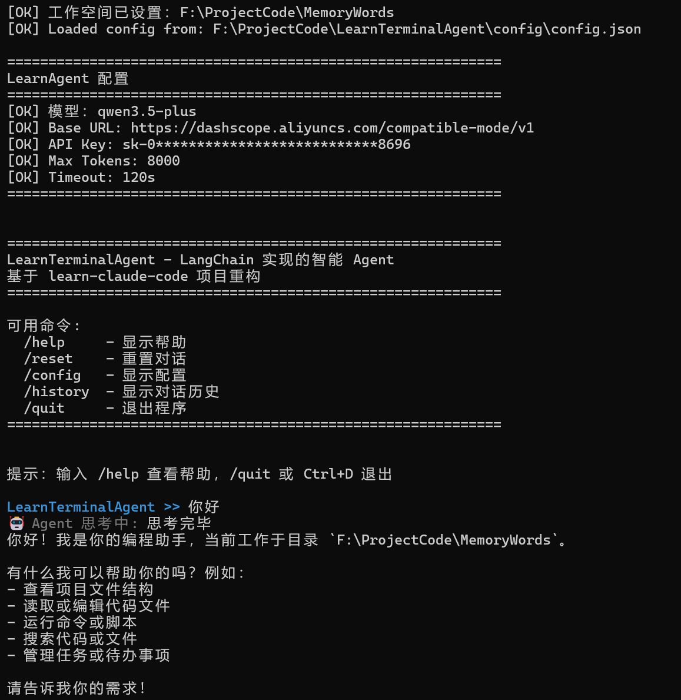
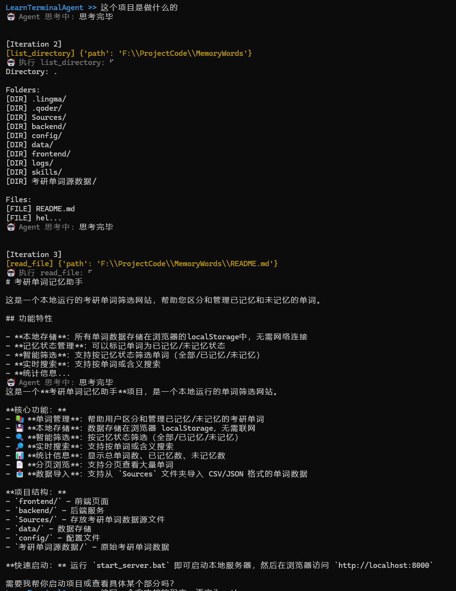
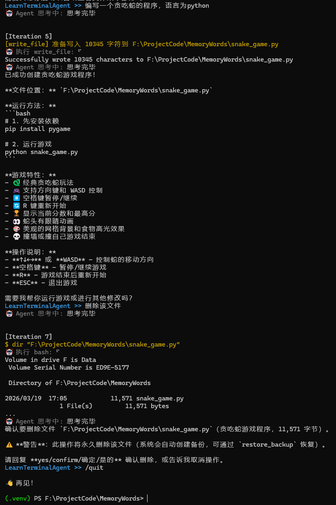

# LearnTerminalAgent

LearnTerminalAgent 是一个基于 LangChain 的智能 Agent 框架，实现了完整的 Agent 循环、工具使用、任务管理、多代理协作等功能，是开源项目 [learn-claude-code](https://github.com/shareAI-lab/learn-claude-code) 的复现版本。

## 🌟 特性

- ✅ **完整的 Agent 循环** - 基于 LangChain 的工具调用驱动
- ✅ **丰富的工具集** - 文件操作、Shell 命令、任务管理等
- ✅ **任务管理** - TodoWrite（内存级）和 Task System（持久化）
- ✅ **子代理委派** - 独立上下文的任务委派
- ✅ **技能系统** - 按需加载外部知识和最佳实践
- ✅ **上下文压缩** - 三层策略管理 token 使用
- ✅ **后台任务** - 非阻塞命令执行
- ✅ **团队协作** - 多代理异步通信
- ✅ **Worktree 隔离** - Git worktree + 任务绑定

## 🚀 快速开始

### 安装

**推荐方式（使用虚拟环境）:**

```bash
# 1. 创建虚拟环境
python -m venv .venv

# 2. 激活虚拟环境
# Windows PowerShell
.\.venv\Scripts\Activate.ps1

# Linux/Mac
source .venv/bin/activate

# 3. 安装项目
pip install-e .
# 或使用 uv（更快）
uv pip install -e .
```

**或者全局安装（不推荐）:**

```bash
pip install -e .
```

### 配置

创建 `.env` 文件：

```bash
QWEN_API_KEY=sk-your-api-key-here
```

### 运行

```bash
python -m learn_agent.main
```

或者直接使用命令行工具：

```bash
learn-terminal-agent
```

详细指南请查看 [快速启动文档](docs/guides/quickstart.md)

## 📚 文档

完整文档请访问 [docs/README.md](docs/README.md)

### 📖 核心文档

- **[快速入门](docs/guides/quickstart.md)** - 5 分钟上手
- **[配置指南](docs/guides/config-guide.md)** - 详细配置说明
- **[工具使用](docs/guides/tools.md)** - 所有内置工具文档
- **[文档索引](docs/INDEX.md)** - 完整导航

### 📚 Learn 系列（原理讲解）

- [s01 - Agent 循环](docs/learn/s01-the-agent-loop.md)
- [s02 - 工具使用](docs/learn/s02-tool-use.md)
- [s03 - 任务管理](docs/learn/s03-todo-write.md)
- [s04 - 子代理](docs/learn/s04-subagent.md)
- [s05 - 技能加载](docs/learn/s05-skill-loading.md)
- [s06 - 上下文压缩](docs/learn/s06-context-compaction.md)
- [s07 - Task System](docs/learn/s07-task-system.md)
- [s08 - 后台任务](docs/learn/s08-background-tasks.md)
- [s09 - 团队协作](docs/learn/s09-agent-teams.md)
- [s10 - 团队协议](docs/learn/s10-team-protocols.md)
- [s11 - 自主代理](docs/learn/s11-autonomous-agents.md)
- [s12 - Worktree 隔离](docs/learn/s12-worktree-isolation.md)

## 💻 使用示例

### 🖼️ 界面预览


*图 1: LearnTerminalAgent 交互式对话界面 - 展示 Agent 与用户的自然语言交互过程*


*图 2: TodoWrite 任务管理系统 - 实时跟踪和管理多任务执行进度*


*图 3: SubAgent 子代理委派 - 智能分解复杂任务并委派给专用子代理执行*

---

### 📝 基础使用

```python
# 导入 Agent 核心类
from learn_agent.agent import AgentLoop

# 创建 Agent 实例，自动加载配置和工具
agent = AgentLoop()

# 运行任务：让 Agent 创建文件并写入内容
response = agent.run("创建一个 hello.txt 文件，写入 Hello World")
print(response)  # 输出执行结果
```

或者运行 main.py 文件直接进行对话交流：

```bash
# 启动交互式命令行界面
python src/learn_agent/main.py

# 进入交互模式后，可以直接输入自然语言指令
# 例如："帮我创建一个 Python 项目结构"
```

### 📋 任务管理

```python
# 添加任务：Agent 会自动创建待办事项
agent.run("添加任务：完成项目文档")

# 更新状态：把任务 1 标记为进行中
agent.run("把任务 1 标记为进行中")

# 查看进度：显示所有任务列表及其状态
agent.run("显示任务列表")
```

**说明**：TodoWrite 系统支持任务的增删改查，自动跟踪任务状态（待处理/进行中/已完成）。

### 🤖 子代理委派

```python
# 委派探索任务给子代理：SubAgent 会独立执行并返回摘要
summary = agent.spawn_subagent("探索项目结构")
print(summary)  # 输出子代理的探索结果
```

**说明**：SubAgent 拥有独立上下文，适合处理需要专注的复杂子任务，避免污染主 Agent 的上下文。

### 🎯 技能加载

```python
# 查看可用技能：列出 skills 目录下所有可用的技能模块
skills = agent.list_skills()
print(f"可用技能：{skills}")

# 加载技能：读取特定技能的最佳实践和指导原则
content = agent.load_skill("code-review")
print(content)  # 输出代码审查技能内容
```

**说明**：Skills 系统允许按需加载外部知识和最佳实践，扩展 Agent 的能力边界。

## 🏗️ 架构设计

### 七层架构结构

项目采用分层架构设计，从扁平结构升级为模块化七层架构：

```
src/learn_agent/
├── core/                    # 核心层 - Agent 大脑
│   ├── agent.py            # AgentLoop 类，完整的 Agent 循环实现
│   ├── config.py           # AgentConfig 数据类，配置管理
│   └── main.py             # 交互式命令行入口
│
├── infrastructure/          # 基础设施层 - 基础支撑
│   ├── logger.py           # 多 logger 日志系统
│   ├── workspace.py        # 工作空间沙箱，路径验证
│   └── project_config.py   # 项目级别配置管理
│
├── tools/                   # 工具层 - 能力提供
│   ├── tools.py            # 基础工具（bash, read_file, write_file 等）
│   ├── todo.py             # TodoWrite 任务管理工具 (s03)
│   ├── task_system.py      # 高级任务系统工具 (s07)
│   └── skills.py           # 技能加载器 (s05)
│
├── agents/                  # 代理扩展层 - 多代理协作
│   ├── subagent.py         # 子代理生成和管理 (s04)
│   ├── teams.py            # 代理团队管理，消息总线 (s09)
│   └── autonomous_agents.py # 自主代理执行 (s11)
│
├── services/                # 服务层 - 高级功能
│   ├── context.py          # 上下文压缩，token 管理 (s06)
│   └── background.py       # 后台进程管理 (s08)
│
├── protocols/               # 协议层 - 通信规范
│   ├── team_protocols.py   # 团队通信协议实现 (s10)
│   └── worktree_isolation.py # Git Worktree 隔离机制 (s12)
│
└── scripts/                 # 脚本层 - 辅助工具
    ├── run.py              # 快速启动脚本
    └── test_config.py      # 配置测试脚本
```

### 数据目录

```
data/
├── .tasks/        # 任务文件 (JSON)
├── .team/         # 团队配置
├── .inbox/        # 消息收件箱
├── .transcripts/  # 对话记录
└── .worktrees/    # Worktree 索引
```

### 架构优势

- **🎯 职责分离**：每层专注于特定功能领域
- **🔧 高度模块化**：易于维护和扩展
- **📦 可复用性**：各层可独立使用和测试
- **🚀 灵活部署**：支持按需加载和组合

## ⚙️ 配置选项

主要配置项（`config/config.json`）：

```json
{
  "agent": {
    "model_name": "qwen3.5-flash",
    "max_tokens": 8000,
    "timeout": 120,
    "max_iterations": 50
  },
  "context": {
    "threshold": 50000,
    "auto_compact_enabled": true
  },
  "tasks": {
    "max_items": 20
  }
}
```

完整配置说明见 [配置指南](docs/guides/config-guide.md)

## 🔧 开发

### 安装开发依赖

```bash
pip install -e ".[dev]"
```

### 代码格式化

```bash
black src/ tests/
ruff check src/ tests/
```

### 运行测试

```bash
pytest tests/
```

## 📦 依赖

核心依赖：

- `langchain` - Agent 框架
- `langchain-openai` - LLM 集成
- `python-dotenv` - 环境变量管理
- `anthropic` - Anthropic API（可选）

## 🤝 贡献

欢迎提交 Issue 和 Pull Request 来改进这个项目！

**仓库地址**: https://github.com/linmowudie/LearnTerminalAgent

## 📄 许可证

MIT License

## 🔗 相关链接

- **[LangChain 文档](https://python.langchain.com/)** - LangChain 官方文档
- **[通义千问 API](https://help.aliyun.com/zh/dashscope/)** - 阿里云百炼大模型服务
- **[项目完整文档](docs/README.md)** - LearnTerminalAgent 详细文档
- **[原始项目](https://github.com/shareAI-lab/learn-claude-code)** - learn-claude-code 开源项目

---

**Happy Coding!** 🚀
