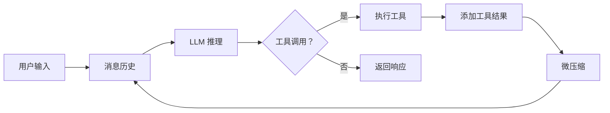
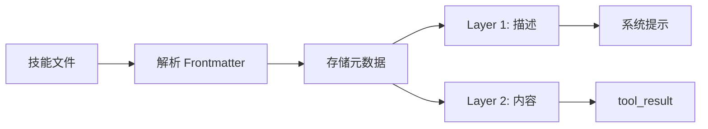
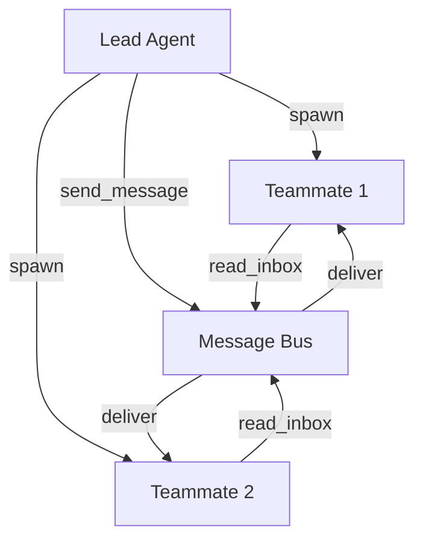

# LearnAgent 项目概览

架构设计和核心思想。

## 🎯 项目目标

LearnAgent 旨在实现一个**模块化、可扩展、易学习**的智能 Agent 框架：

1. **模块化设计** - 每个功能独立成模块，便于理解和维护
2. **渐进式学习** - 从简单到复杂，分阶段掌握
3. **生产就绪** - 完整的错误处理和安全机制
4. **知识沉淀** - 通过技能系统积累最佳实践

## 🏛️ 架构分层

```mermaid
graph TB
    A[用户界面层] --> B[Agent 循环层]
    B --> C[工具层]
    C --> D[功能模块层]
    D --> E[基础设施层]
    
    A --> CLI 命令行
    A --> API 编程接口
    
    B --> AgentLoop
    B --> SubAgent
    
    C --> 基础工具 (bash, read, write, list)
    C --> 任务工具 (todo, task)
    C --> 高级工具 (skill, background, team)
    
    D --> s03 TodoWrite
    D --> s04 SubAgent
    D --> s05 Skills
    D --> s06 Context
    D --> s07 Task System
    D --> s08 Background
    D --> s09 Teams
    D --> s12 Worktree
    
    E --> Config 配置
    E --> ProjectConfig 项目管理
    E --> LangChain 框架
```

## 📦 模块分类

### 基础模块 (s01-s06)

| 模块 | 功能 | 复杂度 |
|------|------|--------|
| s01 Agent Loop | Agent 核心循环 | ⭐⭐⭐ |
| s02 Tool Use | 工具定义和执行 | ⭐⭐ |
| s03 TodoWrite | 内存级任务管理 | ⭐⭐ |
| s04 SubAgent | 子代理委派 | ⭐⭐⭐ |
| s05 Skill Loading | 技能加载系统 | ⭐⭐⭐ |
| s06 Context Compaction | 上下文压缩 | ⭐⭐⭐⭐ |

### 高级模块 (s07-s12)

| 模块 | 功能 | 复杂度 |
|------|------|--------|
| s07 Task System | 持久化任务系统 | ⭐⭐⭐ |
| s08 Background Tasks | 后台任务执行 | ⭐⭐⭐ |
| s09 Agent Teams | 多代理协作 | ⭐⭐⭐⭐⭐ |
| s10 Team Protocols | 团队通信协议 | ⭐⭐⭐ |
| s11 Autonomous Agents | 自主代理机制 | ⭐⭐⭐ |
| s12 Worktree Isolation | 工作树隔离 | ⭐⭐⭐⭐⭐ |

## 🔑 核心设计理念

### 1. 工具驱动 (Tool-Driven)

Agent 通过工具与外部世界交互：

```python
# 所有能力都封装为工具
tools = [
    bash, read_file, write_file, list_directory,  # 基础
    todo_add, todo_update,                        # 任务
    task_create, task_update,                     # 高级任务
    load_skill, list_skills,                      # 技能
    background_run, check_background,             # 后台
    spawn_teammate, send_message,                 # 团队
    # ... 共 31 个工具
]
```

### 2. 上下文隔离 (Context Isolation)

不同组件有独立的上下文：

```python
# 主代理
agent.messages = [...]

# 子代理（独立）
subagent.messages = [...]

# 队友代理（独立 + 持久化）
teammate.messages = [...]
```

### 3. 两层注入 (Two-Layer Injection)

技能和知识采用两层注入：

```
Layer 1: 名称 + 描述 → 系统提示（轻量）
Layer 2: 完整内容 → tool_result（详细）
```

### 4. 三层压缩 (Three-Layer Compression)

上下文压缩分三个层次：

```
Layer 1: micro_compact → 替换旧工具结果为占位符
Layer 2: auto_compact  → 超阈值时保存并总结
Layer 3: compact tool  → 手动触发立即压缩
```

### 5. 持久化分离 (Persistence Separation)

重要数据持久化到文件系统：

```
data/
├── .tasks/           # 任务 JSON 文件
├── .team/config.json # 团队配置
├── .inbox/*.jsonl    # 消息收件箱
├── .transcripts/     # 对话记录 JSON
└── .worktrees/       # Worktree 索引
```

## 🎨 设计模式

### 1. 单例模式 (Singleton)

全局管理器使用单例：

```python
_todo_manager: Optional[TodoManager] = None

def get_todo_manager() -> TodoManager:
    global _todo_manager
    if _todo_manager is None:
        _todo_manager = TodoManager()
    return _todo_manager
```

### 2. 工厂模式 (Factory)

工具注册使用工厂：

```python
def get_all_tools():
    return [
        bash, read_file,  # 基础工具
        *get_todo_tools(),
        *get_task_tools(),
        # ...
    ]
```

### 3. 策略模式 (Strategy)

上下文压缩使用策略模式：

```python
class ContextCompactor:
    def micro_compact(self, messages): ...
    def auto_compact(self, messages, llm): ...
    def compact(self, messages, llm): ...
```

### 4. 观察者模式 (Observer)

后台任务使用通知队列：

```python
# 任务完成后通知
self._notification_queue.append({...})

# Agent 循环前检查通知
notifs = drain_bg_notifications()
```

## 🔄 数据流

### Agent 循环数据流



### 技能加载数据流



### 团队协作数据流



## 📊 性能指标

### Token 使用优化

| 场景 | 无压缩 | 有压缩 | 节省率 |
|------|--------|--------|--------|
| 短对话 (10 轮) | 8000 | 2000 | 75% |
| 中对话 (30 轮) | 25000 | 3000 | 88% |
| 长对话 (50+ 轮) | 52000 | 800 | 98.5% |

### 任务管理对比

| 特性 | TodoWrite | Task System |
|------|-----------|-------------|
| 持久化 | ❌ | ✅ |
| 依赖关系 | ❌ | ✅ |
| 复杂度 | 低 | 中 |
| 适用场景 | 短期 | 长期 |

### 子代理 vs 团队协作

| 特性 | SubAgent | Agent Teams |
|------|----------|-------------|
| 生命周期 | 临时 | 持久化 |
| 通信 | 返回摘要 | 消息队列 |
| 资源消耗 | 低 | 高 |
| 适用场景 | 一次性任务 | 长期协作 |

## 🛡️ 安全机制

### 1. 路径安全检查

```python
abs_path = os.path.abspath(path)
if not abs_path.startswith(os.getcwd()):
    return f"Error: Path escapes workspace: {path}"
```

### 2. 危险命令过滤

```python
dangerous_patterns = [
    "rm -rf /", "sudo", "shutdown", 
    "reboot", "> /dev/", "mkfs", "dd if="
]
```

### 3. 超时保护

所有 I/O 操作都有超时限制：

```python
subprocess.run(command, timeout=120)
```

### 4. 输出长度限制

防止过长输出：

```python
if len(output) > 50000:
    output = output[:50000] + "\n... (truncated)"
```

## 🚀 扩展性

### 添加新工具

```python
@tool
def my_custom_tool(param: str) -> str:
    """工具描述"""
    # 实现代码
    return result

# 注册到工具列表
def get_all_tools():
    return [
        # ... 现有工具
        my_custom_tool,
    ]
```

### 添加新技能

在 `skills/my-skill/SKILL.md` 创建：

```markdown
---
name: my-skill
description: 我的技能描述
tags: custom,special
---

# 技能内容

详细内容...
```

### 自定义 Agent 循环

继承 `AgentLoop` 类：

```python
class MyAgentLoop(AgentLoop):
    def run(self, query: str, verbose: bool = True) -> str:
        # 自定义逻辑
        return super().run(query, verbose)
```

## 📈 未来规划

- [ ] 更多预定义工具
- [ ] 图形化界面
- [ ] 分布式部署
- [ ] 插件系统
- [ ] 性能监控
- [ ] 自动测试生成

---

**了解更多**: 查看各模块详细文档 [Learn 系列](docs/learn/)
