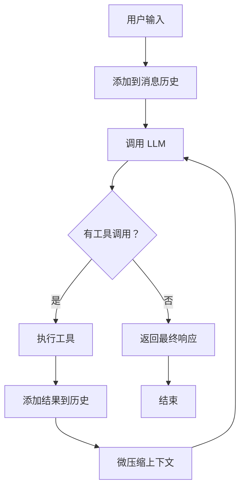

# s01 - The Agent Loop: Agent 核心循环

LearnTerminalAgent 的基础是 Agent 循环机制，它驱动整个智能体的运行。

## 📖 原理介绍

### 核心思想

Agent 循环遵循一个简单的但强大的模式：

```python
while 有工具调用:
    response = LLM(messages, tools)
    execute tools
    append results
```

这个循环持续运行，直到 LLM 不再需要调用工具，表示任务完成。

### 工作流程



### 关键组件

1. **消息历史** (`self.messages`)
   - 存储所有对话记录
   - 包含 System/Human/AI/Tool 消息
   - 支持序列化保存

2. **LLM 绑定** (`self.llm_with_tools`)
   - 使用 LangChain 的 `bind_tools()` API
   - 自动识别工具调用
   - 返回结构化结果

3. **迭代控制** (`self.iteration_count`)
   - 防止无限循环
   - 默认最大 50 次迭代
   - 可配置调整

4. **上下文压缩** (三层策略)
   - Layer 1: micro_compact（每次迭代）
   - Layer 2: auto_compact（超阈值）
   - Layer 3: compact tool（手动触发）

## 💻 实现方法

### 核心代码

位于 [`src/learn_agent/agent.py`](../src/learn_agent/agent.py#L97-L189)

```python
def run(self, query: str, verbose: bool = True) -> str:
    """运行 Agent 循环处理用户查询"""
    # 1. 添加用户消息
    self.messages.append(HumanMessage(content=query))
    
    # 2. 主循环
    while True:
        self.iteration_count += 1
        
        # 3. 检查最大迭代次数
        if self.iteration_count > self.config.max_iterations:
            return f"Error: Reached maximum iterations ({self.config.max_iterations})"
        
        # 4. 调用 LLM
        response = self.llm_with_tools.invoke(self.messages)
        self.messages.append(response)
        
        # 5. 检查是否有工具调用
        if not response.tool_calls:
            return response.content or "思考完成。"
        
        # 6. 执行工具调用
        tool_results = []
        for tool_call in response.tool_calls:
            result = self._execute_tool(tool_call["name"], tool_call["args"])
            tool_results.append({
                "name": tool_call["name"],
                "content": result,
                "tool_call_id": tool_call.get("id", ""),
            })
        
        # 7. 添加工具结果到历史
        for tool_result in tool_results:
            self.messages.append(
                ToolMessage(
                    content=tool_result["content"],
                    tool_call_id=tool_result["tool_call_id"],
                    name=tool_result["name"],
                )
            )
        
        # 8. Layer 1: micro_compact - 压缩旧的工具结果
        self.messages = self.compactor.micro_compact(self.messages)
        
        # 9. Layer 2: auto_compact - 检查是否需要自动压缩
        if self.auto_compact_enabled:
            token_count = estimate_tokens(self.messages)
            if token_count > self.compactor.threshold:
                self.messages = self.compactor.auto_compact(
                    self.messages, self.llm
                )
```

### 工具执行器

```python
def _execute_tool(self, tool_name: str, tool_args: dict) -> str:
    """执行工具调用"""
    # 1. 查找工具
    tool = None
    for t in self.tools:
        if t.name == tool_name:
            tool = t
            break
    
    if not tool:
        return f"Error: Unknown tool '{tool_name}'"
    
    # 2. 执行工具
    try:
        return tool.invoke(tool_args)
    except Exception as e:
        return f"Error executing {tool_name}: {type(e).__name__}: {str(e)}"
```

### 初始化流程

```python
def __init__(self, config: Optional[AgentConfig] = None, system_prompt: Optional[str] = None):
    # 1. 加载配置
    self.config = config or get_config()
    
    # 2. 初始化 LLM
    self.llm = ChatOpenAI(
        model=self.config.model_name,
        base_url=self.config.base_url,
        api_key=self.config.api_key,
        max_tokens=self.config.max_tokens,
    )
    
    # 3. 获取工具并绑定
    self.tools = get_all_tools()
    self.llm_with_tools = self.llm.bind_tools(self.tools)
    
    # 4. 设置系统提示
    self.system_prompt = (
        f"You are a helpful coding agent at {os.getcwd()}. "
        f"Use the provided tools to solve tasks. "
        f"Act efficiently and don't explain too much."
    )
    
    # 5. 初始化消息历史
    self.messages = [SystemMessage(content=self.system_prompt)]
    
    # 6. 初始化计数器
    self.iteration_count = 0
    
    # 7. 初始化压缩器
    self.compactor = get_compactor()
    self.auto_compact_enabled = True
```

## 🔍 详细解析

### 消息类型

Agent 使用四种消息类型：

1. **SystemMessage** - 系统提示
   ```python
   SystemMessage(content="You are a helpful coding agent.")
   ```

2. **HumanMessage** - 用户输入
   ```python
   HumanMessage(content="创建一个 hello.txt 文件")
   ```

3. **AIMessage** - AI 响应（可能包含工具调用）
   ```python
   AIMessage(
       content="好的，我来创建文件",
       tool_calls=[{"name": "write_file", "args": {...}}]
   )
   ```

4. **ToolMessage** - 工具执行结果
   ```python
   ToolMessage(
       content="Successfully wrote 13 characters",
       tool_call_id="abc123",
       name="write_file"
   )
   ```

### 工具调用格式

LLM 返回的工具调用格式：

```python
{
    "name": "write_file",
    "args": {"path": "hello.txt", "content": "Hello"},
    "id": "call_abc123"
}
```

### 上下文压缩集成

每次迭代后自动触发三层压缩：

```python
# Layer 1: micro_compact（静默替换）
self.messages = self.compactor.micro_compact(self.messages)

# Layer 2: auto_compact（超阈值时）
if self.auto_compact_enabled:
    token_count = estimate_tokens(self.messages)
    if token_count > self.compactor.threshold:
        self.messages = self.compactor.auto_compact(
            self.messages, self.llm
        )
```

详细压缩策略见 [s06 - Context Compaction](s06-context-compaction.md)

## 🎯 使用示例

### 基础使用

```python
from learn_agent.agent import AgentLoop

# 创建 Agent
agent = AgentLoop()

# 运行任务
response = agent.run("创建一个 test.txt 文件，写入 Hello World")
print(response)
```

### 自定义配置

```python
from learn_agent.config import AgentConfig

config = AgentConfig(
    model_name="qwen-max",
    max_iterations=100,
    max_tokens=16000,
)

agent = AgentLoop(config=config)
response = agent.run("复杂任务...")
```

### 自定义系统提示

```python
agent = AgentLoop(
    system_prompt="You are a Python expert. Focus on clean code."
)
```

### 禁用详细输出

```python
response = agent.run("任务描述", verbose=False)
```

## ⚙️ 配置选项

相关配置项（`config.py`）：

```python
@dataclass
class AgentConfig:
    # API 配置
    api_key: str = ""
    base_url: str = "https://dashscope.aliyuncs.com/compatible-mode/v1"
    model_name: str = "qwen3.5-flash"
    
    # 运行配置
    max_tokens: int = 8000
    timeout: int = 120
    max_iterations: int = 50  # 最大迭代次数
    
    # 上下文压缩配置
    context_threshold: int = 50000  # token 阈值
    keep_recent: int = 3  # 保留最近工具结果数
    auto_compact_enabled: bool = True  # 自动压缩开关
```

## 🐛 错误处理

### 常见错误

1. **达到最大迭代次数**
   ```
   Error: Reached maximum iterations (50)
   ```
   **解决**: 增加 `max_iterations` 或优化任务

2. **未知工具**
   ```
   Error: Unknown tool 'invalid_tool'
   ```
   **解决**: 检查工具名称拼写

3. **工具执行失败**
   ```
   Error executing read_file: FileNotFoundError: ...
   ```
   **解决**: 检查文件路径和权限

## 📊 性能优化

### 优化建议

1. **合理设置 max_iterations**
   - 简单任务：20-30 次
   - 复杂任务：50-100 次

2. **启用自动压缩**
   - 节省 token 使用
   - 避免上下文过长

3. **使用子代理**
   - 独立任务委派
   - 减少主循环负担

## 🔗 相关模块

- [s02 - Tool Use](s02-tool-use.md) - 工具使用机制
- [s06 - Context Compaction](s06-context-compaction.md) - 上下文压缩
- [s04 - SubAgent](s04-subagent.md) - 子代理委派

---

**下一步**: 了解 [工具使用机制](s02-tool-use.md) →
