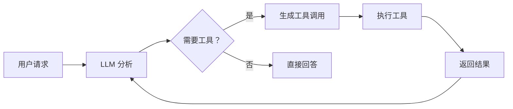

# s02 - Tool Use: 工具使用机制

LearnTerminalAgent 通过工具系统与外部世界交互，这是 Agent 执行实际任务的关键能力。

## 📖 原理介绍

### 核心思想

工具使用基于 LangChain 的 `@tool` 装饰器和 LLM 的工具绑定功能：

1. **定义工具**: 使用 `@tool` 装饰器标记函数
2. **绑定到 LLM**: 通过 `llm.bind_tools()` 让 LLM 知道可用工具
3. **自动调用**: LLM 根据上下文决定何时调用哪个工具
4. **结果反馈**: 执行结果返回给 LLM，形成闭环

### 工作流程



### 工具类型

LearnTerminalAgent 提供四类工具：

1. **基础工具** (s02)
   - `bash` - Shell 命令执行
   - `read_file` - 文件读取
   - `write_file` - 文件写入
   - `list_directory` - 目录列表

2. **任务管理工具** (s03, s07)
   - TodoWrite 系列
   - Task System 系列

3. **高级功能工具** (s05, s08, s09)
   - Skill Loading
   - Background Tasks
   - Team collaboration

4. **隔离工具** (s12)
   - Worktree 管理

## 💻 实现方法

### 工具定义格式

每个工具使用 `@tool` 装饰器定义：

```python
from langchain_core.tools import tool

@tool
def bash(command: str) -> str:
    """
    运行 shell 命令并返回输出
    
    Args:
        command: 要执行的 shell 命令
        
    Returns:
        命令的输出结果
    """
    # 实现代码...
```

### 基础工具实现

#### 1. bash 工具

位于 [`src/learn_agent/tools.py`](../src/learn_agent/tools.py#L14-L54)

```python
@tool
def bash(command: str) -> str:
    """运行 shell 命令"""
    config = get_config()
    
    # 1. 安全检查
    for pattern in config.dangerous_patterns:
        if pattern in command:
            return f"Error: Dangerous command '{pattern}' blocked"
    
    try:
        # 2. 执行命令
        result = subprocess.run(
            command,
            shell=True,
            cwd=os.getcwd(),
            capture_output=True,
            text=True,
            timeout=config.timeout
        )
        
        # 3. 合并输出并限制长度
        output = (result.stdout + result.stderr).strip()
        if len(output) > 50000:
            output = output[:50000] + "\n... (output truncated)"
        
        return output if output else "(no output)"
        
    except subprocess.TimeoutExpired:
        return f"Error: Command timeout after {config.timeout}s"
    except Exception as e:
        return f"Error: {type(e).__name__}: {str(e)}"
```

#### 2. read_file 工具

```python
@tool
def read_file(path: str, limit: Optional[int] = None) -> str:
    """读取文件内容"""
    try:
        # 1. 安全检查：确保路径在工作目录内
        abs_path = os.path.abspath(path)
        if not abs_path.startswith(os.getcwd()):
            return f"Error: Path escapes workspace: {path}"
        
        # 2. 读取文件
        with open(abs_path, 'r', encoding='utf-8') as f:
            lines = f.readlines()
            
            # 3. 可选的行数限制
            if limit and limit < len(lines):
                lines = lines[:limit]
                lines.append(f"\n... ({len(lines) - limit} more lines)")
            
            content = ''.join(lines)
            return content[:50000] if len(content) > 50000 else content
            
    except FileNotFoundError:
        return f"Error: File not found: {path}"
    except Exception as e:
        return f"Error: {type(e).__name__}: {str(e)}"
```

#### 3. write_file 工具

```python
@tool
def write_file(path: str, content: str) -> str:
    """写入文件内容"""
    try:
        # 1. 安全检查
        abs_path = os.path.abspath(path)
        if not abs_path.startswith(os.getcwd()):
            return f"Error: Path escapes workspace: {path}"
        
        # 2. 创建父目录
        os.makedirs(os.path.dirname(abs_path) or '.', exist_ok=True)
        
        # 3. 写入文件
        with open(abs_path, 'w', encoding='utf-8') as f:
            f.write(content)
        
        return f"Successfully wrote {len(content)} characters to {path}"
        
    except Exception as e:
        return f"Error: {type(e).__name__}: {str(e)}"
```

#### 4. list_directory 工具

```python
@tool
def list_directory(path: str = ".") -> str:
    """列出目录内容"""
    try:
        abs_path = os.path.abspath(path)
        
        if not abs_path.startswith(os.getcwd()):
            return f"Error: Path escapes workspace: {path}"
        
        if not os.path.exists(abs_path):
            return f"Error: Directory not found: {path}"
        
        items = os.listdir(abs_path)
        
        # 分类文件和目录
        dirs = []
        files = []
        
        for item in sorted(items):
            item_path = os.path.join(abs_path, item)
            if os.path.isdir(item_path):
                dirs.append(f"📁 {item}/")
            else:
                files.append(f"📄 {item}")
        
        result = [f"Directory: {abs_path}"]
        if dirs:
            result.append("\nFolders:")
            result.extend(dirs)
        if files:
            result.append("\nFiles:")
            result.extend(files)
        
        return '\n'.join(result)
        
    except Exception as e:
        return f"Error: {type(e).__name__}: {str(e)}"
```

### 工具注册系统

所有工具通过 `get_all_tools()` 统一注册：

```python
def get_all_tools():
    """获取所有可用工具"""
    from .todo import get_todo_tools
    from .task_system import get_task_tools
    from .background import get_background_tools
    from .teams import get_team_tools
    from .skills import get_skill_tools
    
    return [
        # 基础工具
        bash,
        read_file,
        write_file,
        list_directory,
        # Todo 工具 (s03)
        *get_todo_tools(),
        # Task System 工具 (s07)
        *get_task_tools(),
        # Background Tools (s08)
        *get_background_tools(),
        # Team Tools (s09)
        *get_team_tools(),
        # Skill Tools (s05)
        *get_skill_tools(),
    ]
```

### 工具绑定到 LLM

在 Agent 初始化时绑定：

```python
# 获取所有工具
self.tools = get_all_tools()

# 绑定到 LLM
self.llm_with_tools = self.llm.bind_tools(self.tools)
```

### 工具执行器

Agent 中的工具执行逻辑：

```python
def _execute_tool(self, tool_name: str, tool_args: dict) -> str:
    """执行工具调用"""
    # 1. 查找工具
    tool = None
    for t in self.tools:
        if t.name == tool_name:
            tool = t
            break
    
    if not tool:
        return f"Error: Unknown tool '{tool_name}'"
    
    # 2. 执行工具
    try:
        return tool.invoke(tool_args)
    except Exception as e:
        return f"Error executing {tool_name}: {type(e).__name__}: {str(e)}"
```

## 🔍 安全机制

### 1. 路径安全检查

所有文件操作都进行路径验证：

```python
abs_path = os.path.abspath(path)
if not abs_path.startswith(os.getcwd()):
    return f"Error: Path escapes workspace: {path}"
```

防止访问工作目录外的文件。

### 2. 危险命令过滤

bash 工具检查危险模式：

```python
dangerous_patterns = [
    "rm -rf /", "sudo", "shutdown", 
    "reboot", "> /dev/", "mkfs", "dd if="
]

for pattern in dangerous_patterns:
    if pattern in command:
        return f"Error: Dangerous command '{pattern}' blocked"
```

### 3. 输出长度限制

防止过长输出消耗 token：

```python
if len(output) > 50000:
    output = output[:50000] + "\n... (output truncated)"
```

### 4. 超时保护

所有命令都有超时机制：

```python
result = subprocess.run(
    command,
    timeout=config.timeout  # 默认 120 秒
)
```

## 🎯 使用示例

### 自然语言调用

Agent 会自动选择合适的工具：

```python
# 创建文件
agent.run("创建一个 hello.txt 文件，写入 Hello World")

# 读取文件
agent.run("读取 hello.txt 的内容")

# 运行命令
agent.run("运行 python --version")

# 列出目录
agent.run("src 目录下有哪些文件？")
```

### 直接使用工具

也可以直接调用工具函数：

```python
from learn_agent.tools import bash, read_file

# 执行命令
result = bash.invoke({"command": "ls -la"})

# 读取文件
content = read_file.invoke({"path": "README.md"})
```

### 组合使用

复杂任务通常需要多个工具协作：

```
用户：创建一个 test.py 文件并运行

Agent 思考过程:
1. 调用 write_file 创建 test.py
2. 调用 bash 运行 python test.py
3. 返回结果
```

实际对话流：

```
LearnAgent >> 创建一个 test.py 文件，打印 Hello，然后运行它

[Iteration 1]
🟡 [write_file] {'path': 'test.py', 'content': 'print("Hello")'}
Successfully wrote 13 characters to test.py

[Iteration 2]
🟡 $ python test.py
Hello

Done! The file was created and executed successfully.
```

## ⚙️ 配置选项

### 安全配置

```python
@dataclass
class AgentConfig:
    dangerous_patterns: List[str] = field(default_factory=lambda: [
        "rm -rf /", "sudo", "shutdown", 
        "reboot", "> /dev/", "mkfs", "dd if="
    ])
```

### 超时配置

```python
@dataclass
class AgentConfig:
    timeout: int = 120  # 秒
```

### 输出限制

硬编码在工具中（50000 字符）。

## 🐛 错误处理

### 常见错误及解决

1. **文件未找到**
   ```
   Error: File not found: nonexistent.txt
   ```
   **解决**: 检查文件路径

2. **路径越界**
   ```
   Error: Path escapes workspace: /etc/passwd
   ```
   **解决**: 使用工作目录内的路径

3. **命令超时**
   ```
   Error: Command timeout after 120s
   ```
   **解决**: 增加 timeout 或优化命令

4. **危险命令被阻止**
   ```
   Error: Dangerous command 'rm -rf' blocked
   ```
   **解决**: 使用安全的替代方案

## 📊 性能考虑

### 优化建议

1. **批量操作**: 单个命令完成多个操作
   ```bash
   # 好：一条命令
   mkdir -p a/b/c && echo "test" > a/b/c/file.txt
   
   # 不好：多条命令
   mkdir a
   cd a && mkdir b
   cd b && mkdir c
   ```

2. **限制输出**: 使用工具参数
   ```python
   read_file.invoke({"path": "large.log", "limit": 100})
   ```

3. **避免冗余**: 减少不必要的工具调用
   ```python
   # 好：一次写入
   write_file.invoke({"path": "config.json", "content": json_data})
   
   # 不好：多次追加
   ```

## 🔗 相关模块

- [s01 - Agent Loop](s01-the-agent-loop.md) - 工具调用集成
- [s03 - TodoWrite](s03-todo-write.md) - 任务工具
- [s07 - Task System](s07-task-system.md) - 高级任务工具

---

**下一步**: 了解 [任务管理实现](s03-todo-write.md) →
