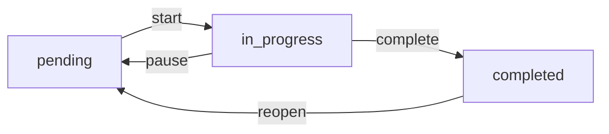

# s03 - TodoWrite: 任务管理实现

LearnTerminalAgent 提供两层任务管理系统：TodoWrite（内存级）和 Task System（持久化）。本节介绍基础的 TodoWrite 功能。

## 📖 原理介绍

### 核心思想

TodoWrite 是一个轻量级、内存级的任务管理系统，用于追踪短期任务的进度。

**特点**:
- ✅ 简单易用
- ✅ 实时状态追踪
- ✅ 自动验证约束
- ⚠️ 不持久化（上下文压缩后丢失）

### 数据结构

```python
@dataclass
class TodoItem:
    """任务项"""
    id: str              # 唯一标识（自增数字字符串）
    text: str            # 任务描述
    status: str = "pending"  # pending | in_progress | completed
```

### 状态流转



### 约束条件

1. **数量限制**: 最多 20 个任务（可配置）
2. **唯一进行中**: 同时只能有一个 `in_progress` 任务
3. **内容非空**: 任务描述不能为空字符串

## 💻 实现方法

### TodoManager 类

完整实现位于 [`src/learn_agent/todo.py`](../src/learn_agent/todo.py)

```python
class TodoManager:
    """任务管理器"""
    
    def __init__(self, max_items: int = 20):
        self.items: List[TodoItem] = []
        self.max_items = max_items
        self._counter = 0  # 用于生成唯一 ID
```

### 核心方法

#### 1. 添加任务

```python
def add(self, text: str) -> TodoItem:
    """添加新任务"""
    self._counter += 1
    item = TodoItem(id=str(self._counter), text=text)
    self.items.append(item)
    self._validate()  # 验证约束
    return item
```

**使用示例**:
```python
manager = get_todo_manager()
item = manager.add("完成项目文档")
# 返回：TodoItem(id="1", text="完成项目文档", status="pending")
```

#### 2. 更新任务

```python
def update(self, item_id: str, status: str, text: Optional[str] = None) -> Optional[TodoItem]:
    """更新任务状态或内容"""
    for item in self.items:
        if item.id == item_id:
            if status:
                item.status = status
            if text:
                item.text = text
            self._validate()
            return item
    return None
```

**使用示例**:
```python
# 更新状态
manager.update("1", "in_progress")

# 更新内容
manager.update("1", None, "完成项目文档 - 修订版")

# 同时更新
manager.update("1", "completed", "最终版本")
```

#### 3. 删除任务

```python
def remove(self, item_id: str) -> bool:
    """删除任务"""
    for i, item in enumerate(self.items):
        if item.id == item_id:
            del self.items[i]
            return True
    return False
```

#### 4. 渲染列表

```python
def render(self) -> str:
    """渲染任务列表"""
    if not self.items:
        return "No todos."
    
    lines = []
    for item in self.items:
        marker = {
            "pending": "[ ]",
            "in_progress": "[>]",
            "completed": "[x]"
        }[item.status]
        lines.append(f"{marker} #{item.id}: {item.text}")
    
    # 统计进度
    done = sum(1 for item in self.items if item.status == "completed")
    lines.append(f"\n({done}/{len(self.items)} completed)")
    
    return "\n".join(lines)
```

**输出示例**:
```
[ ] #1: 完成项目文档
[>] #2: 编写测试用例
[x] #3: 初始化仓库

(1/3 completed)
```

#### 5. 进度统计

```python
def get_progress(self) -> Dict:
    """获取进度统计"""
    total = len(self.items)
    done = sum(1 for item in self.items if item.status == "completed")
    in_progress = sum(1 for item in self.items if item.status == "in_progress")
    pending = total - done - in_progress
    
    return {
        "total": total,
        "completed": done,
        "in_progress": in_progress,
        "pending": pending,
        "percentage": (done / total * 100) if total > 0 else 0
    }
```

### 验证机制

```python
def _validate(self):
    """验证任务列表"""
    # 1. 检查数量
    if len(self.items) > self.max_items:
        raise ValueError(f"Max {self.max_items} todos allowed")
    
    # 2. 检查只有一个 in_progress
    in_progress_count = sum(
        1 for item in self.items if item.status == "in_progress"
    )
    if in_progress_count > 1:
        raise ValueError("Only one task can be in_progress at a time")
    
    # 3. 验证每个任务内容非空
    for item in self.items:
        if not item.text.strip():
            raise ValueError(f"Item {item.id}: text required")
```

### 工具定义

五个 LangChain 工具：

```python
@tool
def todo_add(text: str) -> str:
    """添加新任务到待办列表"""
    manager = get_todo_manager()
    item = manager.add(text)
    return f"Added task #{item.id}. Current list:\n{manager.render()}"

@tool
def todo_update(item_id: str, status: str, text: Optional[str] = None) -> str:
    """更新任务状态或内容"""
    manager = get_todo_manager()
    item = manager.update(item_id, status, text)
    if item:
        return f"Updated task #{item_id}. Current list:\n{manager.render()}"
    else:
        return f"Error: Task #{item_id} not found"

@tool
def todo_remove(item_id: str) -> str:
    """删除任务"""
    manager = get_todo_manager()
    if manager.remove(item_id):
        return f"Removed task #{item_id}. Current list:\n{manager.render()}"
    else:
        return f"Error: Task #{item_id} not found"

@tool
def todo_list() -> str:
    """列出所有任务"""
    manager = get_todo_manager()
    return manager.render()

@tool
def todo_progress() -> str:
    """显示任务进度统计"""
    manager = get_todo_manager()
    progress = manager.get_progress()
    
    lines = [
        f"Total: {progress['total']} tasks",
        f"Completed: {progress['completed']}",
        f"In Progress: {progress['in_progress']}",
        f"Pending: {progress['pending']}",
        f"Progress: {progress['percentage']:.1f}%"
    ]
    
    return "\n".join(lines)
```

### Agent 集成

在 `agent.py` 中的方法：

```python
class AgentLoop:
    # ========== s03: TodoWrite 功能 ==========
    
    def get_todo_progress(self) -> str:
        """获取任务进度"""
        manager = get_todo_manager()
        return manager.render()
    
    def reset_todo(self):
        """重置任务管理器"""
        reset_todo()
```

### 全局管理器

```python
# 全局任务管理器实例
_todo_manager: Optional[TodoManager] = None

def get_todo_manager() -> TodoManager:
    """获取全局任务管理器"""
    global _todo_manager
    if _todo_manager is None:
        _todo_manager = TodoManager()
    return _todo_manager

def reset_todo():
    """重置任务管理器"""
    global _todo_manager
    _todo_manager = TodoManager()
```

## 🎯 使用示例

### 自然语言调用

```python
# 添加任务
agent.run("添加一个任务：完成项目文档")
# 输出：Added task #1. Current list:
#       [ ] #1: 完成项目文档
#       (0/1 completed)

# 更新状态
agent.run("把任务 1 标记为进行中")
# 输出：Updated task #1. Current list:
#       [>] #1: 完成项目文档
#       (0/1 completed)

# 查看列表
agent.run("显示我的任务列表")
# 输出：[>] #1: 完成项目文档
#       (0/1 completed)

# 完成任务
agent.run("完成任务 1")
# 输出：Updated task #1. Current list:
#       [x] #1: 完成项目文档
#       (1/1 completed)
```

### 直接使用 API

```python
from learn_agent.todo import get_todo_manager

manager = get_todo_manager()

# 添加任务
item1 = manager.add("学习 s03 模块")
item2 = manager.add("实践任务管理")

# 开始第一个任务
manager.update("1", "in_progress")

# 查看进度
progress = manager.get_progress()
print(f"进度：{progress['percentage']:.1f}%")  # 0.0%

# 完成任务
manager.update("1", "completed")

# 获取统计
stats = manager.get_progress()
print(stats)
# {'total': 2, 'completed': 1, 'in_progress': 0, 'pending': 1, 'percentage': 50.0}
```

### 实际工作流

```
用户：我要开发一个新功能

Agent:
1. todo_add("需求分析")
   → [ ] #1: 需求分析

2. todo_update("1", "in_progress")
   → [>] #1: 需求分析

3. ... (执行分析工作)

4. todo_update("1", "completed")
   → [x] #1: 需求分析

5. todo_add("编写代码")
   → [x] #1: 需求分析
     [ ] #2: 编写代码

6. todo_update("2", "in_progress")
   → [x] #1: 需求分析
     [>] #2: 编写代码
```

## ⚙️ 配置选项

### 最大任务数

```python
@dataclass
class AgentConfig:
    max_todos: int = 20  # 最多 20 个任务
```

修改配置：

```python
config = AgentConfig(max_todos=50)
agent = AgentLoop(config=config)
```

## 🐛 错误处理

### 常见错误

1. **超过最大任务数**
   ```
   ValueError: Max 20 todos allowed
   ```
   **解决**: 完成一些任务或删除不必要的任务

2. **多个进行中任务**
   ```
   ValueError: Only one task can be in_progress at a time
   ```
   **解决**: 先将当前 in_progress 任务标记为 completed 或 pending

3. **任务不存在**
   ```
   Error: Task #99 not found
   ```
   **解决**: 检查任务 ID 是否正确

4. **空任务描述**
   ```
   ValueError: Item 1: text required
   ```
   **解决**: 提供有效的任务描述

## 📊 与 Task System 对比

| 特性 | TodoWrite (s03) | Task System (s07) |
|------|----------------|-------------------|
| 持久化 | ❌ 内存级 | ✅ JSON 文件 |
| 依赖关系 | ❌ 不支持 | ✅ blockedBy/blocks |
| 任务所有者 | ❌ 不支持 | ✅ owner 字段 |
| 复杂度 | ⭐ 简单 | ⭐⭐⭐ 中等 |
| 适用场景 | 短期任务 | 长期/复杂项目 |

## 🔗 最佳实践

1. **及时更新状态**: 保持任务状态准确
2. **合理分解**: 大任务拆分为小任务
3. **单一焦点**: 一次只进行一个任务
4. **定期清理**: 删除已完成/废弃的任务
5. **配合使用**: 复杂项目用 Task System

## 🔗 相关模块

- [s07 - Task System](s07-task-system.md) - 高级任务管理
- [s01 - Agent Loop](s01-the-agent-loop.md) - Agent 如何调用工具
- [s08 - Background Tasks](s08-background-tasks.md) - 后台任务管理

---

**下一步**: 了解 [子代理委派机制](s04-subagent.md) →
