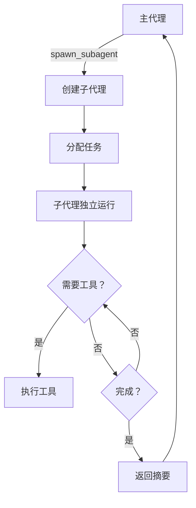

# s04 - SubAgent: 子代理委派机制

LearnTerminalAgent 支持任务委派，主代理可以创建子代理来执行独立的子任务。

## 📖 原理介绍

### 核心思想

**上下文隔离的任务委派**:
- 主代理和子代理有独立的消息历史
- 共享文件系统和工具
- 子代理完成任务后返回摘要给主代理

### 使用场景

1. **独立子任务**: 可以独立完成的明确任务
2. **探索性工作**: 需要大量试错的探索
3. **专业化任务**: 需要特定专业知识的任务
4. **并行工作**: 可以同时进行的多个任务

### 工作流程



## 💻 实现方法

### SubAgent 类

完整实现位于 [`src/learn_agent/agents/subagent.py`](../../src/learn_agent/agents/subagent.py)

#### 系统提示词系统

子代理现在支持三种方式的系统提示词：

1. **自定义提示词**（最高优先级）：直接传入 `system_prompt` 参数
2. **文件加载提示词**（默认）：从 `prompts/subagent_prompt_zh.md` 加载中文提示词
3. **简化默认提示词**（后备）：当文件不存在时使用的英文简版

**提示词文件路径**:
```python
DEFAULT_SUBAGENT_PROMPT_PATH = Path(__file__).parent.parent.parent.parent / "prompts" / "subagent_prompt_zh.md"
```

**加载逻辑**:
```python
def load_subagent_prompt(
    prompt_path: Optional[Path] = None,
    workspace_root: str = "",
    task_description: str = "",
) -> str:
    """
    加载子代理提示词模板
    
    Args:
        prompt_path: 提示词文件路径，None 则使用默认路径
        workspace_root: 工作空间根目录
        task_description: 任务描述
        
    Returns:
        渲染后的提示词字符串
    """
    path = prompt_path if prompt_path else DEFAULT_SUBAGENT_PROMPT_PATH
    
    if not path.exists():
        # 如果提示词文件不存在，返回简化的默认提示词
        return (
            f"你是由主代理委派的专属子代理，工作目录：{workspace_root}\n"
            f"高效完成指定任务，并返回清晰的摘要。\n"
            f"当前任务：{task_description}"
        )
    
    try:
        with open(path, 'r', encoding='utf-8') as f:
            template = f.read()
        
        # 替换占位符
        rendered = template.replace("{workspace_root}", workspace_root)
        rendered = rendered.replace("{task_description}", task_description)
        
        return rendered
    except Exception as e:
        # 加载失败时返回简化版本
        return (
            f"你是由主代理委派的专属子代理，工作目录：{workspace_root}\n"
            f"高效完成指定任务，并返回清晰的摘要。\n"
            f"当前任务：{task_description}"
        )
```

#### SubAgent 初始化

```python
class SubAgent:
    """
    子代理类
    
    子代理在独立的上下文中工作，共享文件系统但不共享消息历史。
    完成任务后只返回摘要给父代理。
    """
    
    def __init__(
        self,
        parent_config: Optional[AgentConfig] = None,
        system_prompt: Optional[str] = None,
        prompt_path: Optional[Path] = None,  # 新增参数
    ):
        """
        初始化子代理
        
        Args:
            parent_config: 父代理配置
            system_prompt: 系统提示词（优先级高于文件加载）
            prompt_path: 提示词文件路径（可选，默认使用 prompts/subagent_prompt_zh.md）
        """
        # 继承主代理的工作空间（关键！）
        self.workspace = get_workspace()
        
        # 使用父代理的配置或默认配置
        self.config = parent_config or get_config()
        
        # 初始化 LLM
        self.llm = ChatOpenAI(
            model=self.config.model_name,
            base_url=self.config.base_url,
            api_key=self.config.api_key,
            max_tokens=self.config.max_tokens,
        )
        
        # 获取工具并绑定（与主代理相同的工具集）
        self.tools = get_all_tools()
        self.llm_with_tools = self.llm.bind_tools(self.tools)
        
        # 系统提示 - 优先级：自定义 > 文件加载 > 默认
        if system_prompt:
            self.system_prompt = system_prompt
        else:
            # 从文件加载提示词
            self.system_prompt = load_subagent_prompt(
                prompt_path=prompt_path,
                workspace_root=self.workspace.root,
                task_description="等待分配任务..."
            )
        
        # 独立的消息历史（与父代理隔离）
        self.messages: List = [
            SystemMessage(content=self.system_prompt)
        ]
        
        # 迭代计数器
        self.iteration_count = 0
```

### 运行方法

```python
def run(self, task: str, verbose: bool = False) -> str:
    """
    运行子代理完成任务
    
    Args:
        task: 任务描述
        verbose: 是否打印详细日志
        
    Returns:
        任务完成的摘要
    """
    # 1. 添加任务到消息历史
    self.messages.append(HumanMessage(content=task))
    
    if verbose:
        print(f"\n[SubAgent Starting Task]")
        print(f"Task: {task[:100]}...")
    
    # 2. 主循环（与主 Agent 类似）
    while True:
        self.iteration_count += 1
        
        # 检查最大迭代次数
        if self.iteration_count > self.config.max_iterations:
            return f"Error: SubAgent reached maximum iterations ({self.config.max_iterations})"
        
        # 调用 LLM
        response = self.llm_with_tools.invoke(self.messages)
        self.messages.append(response)
        
        # 检查是否有工具调用
        if not response.tool_calls:
            # 没有工具调用，任务完成，返回摘要
            summary = response.content or "Task completed."
            if verbose:
                print(f"\n[SubAgent Task Complete]")
                print(f"Summary: {summary}")
            return summary
        
        # 执行工具调用
        if verbose:
            print(f"\n[SubAgent Iteration {self.iteration_count}]")
        
        for tool_call in response.tool_calls:
            tool_name = tool_call["name"]
            tool_args = tool_call["args"]
            
            if verbose:
                print(f"  Using {tool_name}: {tool_args}")
            
            # 执行工具
            result = self._execute_tool(tool_name, tool_args)
            
            if verbose and result:
                preview = result[:100]
                if len(result) > 100:
                    preview += "..."
                print(f"  Result: {preview}")
            
            # 添加结果到消息历史
            self.messages.append(
                ToolMessage(
                    content=result,
                    tool_call_id=tool_call.get("id", ""),
                    name=tool_name,
                )
            )
    
    return ""
```

### 工具执行器

```python
def _execute_tool(self, tool_name: str, tool_args: dict) -> str:
    """执行工具调用"""
    # 查找工具
    tool = None
    for t in self.tools:
        if t.name == tool_name:
            tool = t
            break
    
    if not tool:
        return f"Error: Unknown tool '{tool_name}'"
    
    # 执行工具
    try:
        return tool.invoke(tool_args)
    except Exception as e:
        return f"Error executing {tool_name}: {type(e).__name__}: {str(e)}"
```

### spawn_subagent 函数

便捷函数用于创建并运行子代理：

```python
def spawn_subagent(
    task: str,
    config: Optional[AgentConfig] = None,
    system_prompt: Optional[str] = None,
    prompt_path: Optional[Path] = None,  # 新增参数
    verbose: bool = True,
) -> str:
    """
    创建并运行子代理
    
    Args:
        task: 任务描述
        config: 配置（可选）
        system_prompt: 系统提示（可选，优先级高于文件加载）
        prompt_path: 提示词文件路径（可选，默认使用 prompts/subagent_prompt_zh.md）
        verbose: 是否详细输出
        
    Returns:
        子代理的任务摘要
    """
    agent = SubAgent(
        parent_config=config,
        system_prompt=system_prompt,
        prompt_path=prompt_path,
    )
    return agent.run(task, verbose=verbose)
```

### Agent 集成

在 `agent.py` 中的方法：

```python
class AgentLoop:
    # ========== s04: SubAgent 功能 ==========
    
    def spawn_subagent(
        self,
        task: str,
        system_prompt: Optional[str] = None,
        prompt_path: Optional[Path] = None,  # 新增参数
        verbose: bool = True,
    ) -> str:
        """
        创建子代理执行任务
        
        Args:
            task: 任务描述
            system_prompt: 子代理系统提示（可选，优先级高于文件加载）
            prompt_path: 提示词文件路径（可选，默认使用 prompts/subagent_prompt_zh.md）
            verbose: 是否详细输出
            
        Returns:
            子代理的任务摘要
        """
        return spawn_subagent(
            task=task,
            config=self.config,
            system_prompt=system_prompt,
            prompt_path=prompt_path,
            verbose=verbose,
        )
```

## 🎯 使用示例

### 自然语言委派

```python
# 主代理接收任务
agent.run("帮我探索这个项目的结构，用子代理完成")

# 主代理委派给子代理
[Iteration 1]
🟡 [spawn_subagent] {'task': 'Explore project structure'}

[SubAgent Starting Task]
Task: Explore project structure...

[SubAgent Iteration 1]
  Using list_directory: {'path': '.'}
  Result: Directory structure...

[SubAgent Iteration 2]
  Using read_file: {'path': 'README.md'}
  Result: Project description...

[SubAgent Task Complete]
Summary: The project has 5 directories (config, docs, src, skills, data) 
and 20 files. Main components are in src/learn_agent/. README.md provides 
setup instructions.

Done! I've delegated the exploration task to a subagent. Here's what it found:
The project has 5 directories and 20 files...
```

### 自定义系统提示

```python
agent.spawn_subagent(
    task="Review the code quality",
    system_prompt="""You are a senior code reviewer. Focus on:
1. Code style and formatting
2. Error handling
3. Performance optimizations
4. Security issues

Provide detailed feedback.""",
    verbose=True
)
```

### 专用子代理

```python
# 测试专家
agent.spawn_subagent(
    task="Write unit tests for the agent module",
    system_prompt="You are a testing expert. Write comprehensive tests with edge cases."
)

# 文档专家
agent.spawn_subagent(
    task="Improve the documentation",
    system_prompt="You are a technical writer. Create clear, concise docs with examples."
)
```

### 嵌套委派

```python
# 主代理 → 子代理 1 → 孙代理
agent.run("完成整个项目重构")
  ↓
子代理 1: "负责架构设计"
  ↓ (可以进一步委派)
孙代理："分析现有架构"
```

### 使用默认中文提示词（推荐）

从 v2.0 开始，子代理默认使用中文提示词文件 `prompts/subagent_prompt_zh.md`：

```python
# 直接使用默认中文提示词
summary = agent.spawn_subagent(task="探索项目结构")

# 子代理会自动遵循以下准则：
# - 任务聚焦：专注于分配的具体任务
# - 效率优先：直接调用工具收集信息
# - 边界意识：所有操作在工作空间内
# - 结构化摘要：返回包含完成任务、关键发现、注意事项、修改文件的摘要
```

### 使用自定义提示词文件

```python
from pathlib import Path

# 使用专门的数据库优化提示词
summary = agent.spawn_subagent(
    task="优化数据库查询性能",
    prompt_path=Path("prompts/db_expert_prompt.md")
)

# 使用代码审查专用提示词
summary = agent.spawn_subagent(
    task="审查 src/目录的代码质量",
    prompt_path=Path("prompts/code_reviewer_prompt.md")
)
```

### 优先级规则

```python
# 1. 自定义 system_prompt（最高优先级）
agent.spawn_subagent(
    task="特殊任务",
    system_prompt="完全自定义的提示词..."  # 会覆盖文件加载
)

# 2. 文件加载提示词（默认）
agent.spawn_subagent(task="普通任务")  
# 自动从 prompts/subagent_prompt_zh.md 加载

# 3. 简化默认提示词（后备）
# 当提示词文件不存在时自动使用
```

## 🔍 关键特性

### 1. 上下文隔离

```python
# 主代理的消息历史
self.messages = [SystemMessage(...), HumanMessage(...), ...]

# 子代理有完全独立的消息历史
subagent.messages = [SystemMessage(...), HumanMessage(task), ...]

# 子代理的结果不会污染主代理上下文
# 只有最终摘要返回给主代理
```

### 2. 共享文件系统

```python
# 都使用相同的工作目录
os.getcwd()  # 对主代理和子代理相同

# 都可以读写相同的文件
agent.run("创建 test.txt")  # 创建文件
agent.spawn_subagent("读取 test.txt")  # 可以读取刚创建的文件
```

### 3. 相同的工具集

```python
# 子代理使用与主代理相同的工具
self.tools = get_all_tools()  # 完全相同的工具列表
```

### 4. 独立的迭代计数

```python
# 主代理和子代理有各自的计数器
agent.iteration_count      # 主代理的迭代
subagent.iteration_count   # 子代理的迭代

# 互不影响
```

## ⚙️ 配置选项

### 继承配置

子代理默认继承父代理的配置：

```python
self.config = parent_config or get_config()
```

也可以提供独立配置：

```python
sub_config = AgentConfig(
    model_name="qwen-max",  # 使用更强的模型
    max_iterations=100,     # 更多迭代次数
)

agent.spawn_subagent(
    task="复杂任务",
    config=sub_config
)
```

## 🐛 错误处理

### 常见错误

1. **达到最大迭代次数**
   ```
   Error: SubAgent reached maximum iterations (50)
   ```
   **解决**: 增加 `max_iterations` 或简化任务

2. **未知工具**
   ```
   Error: Unknown tool 'invalid'
   ```
   **解决**: 确保工具名称正确

3. **任务不清晰**
   ```
   SubAgent returns vague summary
   ```
   **解决**: 提供更具体的任务描述和系统提示

4. **提示词文件加载失败**
   ```
   Warning: Failed to load prompt file, using default
   ```
   **解决**: 检查 `prompts/subagent_prompt_zh.md` 文件是否存在，或使用自定义 `system_prompt`

## 📊 性能考虑

### 优势

✅ **减少主代理负担**: 复杂子任务委派出去  
✅ **专注执行**: 子代理有专门的系统提示  
✅ **可重用**: 可以多次创建不同用途的子代理  
✅ **错误隔离**: 子代理失败不影响主代理  

### 劣势

⚠️ **额外成本**: 每次 spawn 都需要新的 LLM 调用  
⚠️ **上下文丢失**: 子代理的详细过程不保留在主代理中  
⚠️ **调试困难**: 需要 verbose 模式才能看到子代理行为  

### 最佳实践

1. **明确任务边界**: 子任务应该是独立、明确的
2. **提供充分信息**: 在任务描述中包含必要的上下文
3. **合理使用系统提示**: 
   - 一般任务使用默认中文提示词即可
   - 特殊任务使用自定义 `system_prompt` 或 `prompt_path`
4. **启用 verbose**: 开发阶段开启详细日志
5. **检查结果**: 验证子代理的摘要是否准确
6. **避免过度委派**: 简单任务直接由主代理完成
7. **注意迭代次数**: 复杂任务可能需要更多迭代，可适当调整配置

## 🔗 与相关模块对比

| 特性 | SubAgent (s04) | Agent Teams (s09) |
|------|---------------|-------------------|
| 生命周期 | 临时 | 持久化 |
| 通信方式 | 返回摘要 | 消息队列 |
| 适用场景 | 一次性任务 | 长期协作 |
| 复杂度 | ⭐⭐ | ⭐⭐⭐⭐⭐ |

## 🔗 相关模块

- [s01 - Agent Loop](s01-the-agent-loop.md) - 主代理循环
- [s09 - Agent Teams](s09-agent-teams.md) - 持久化团队协作
- [s02 - Tool Use](s02-tool-use.md) - 工具使用

---

**下一步**: 了解 [技能加载机制](s05-skill-loading.md) →
