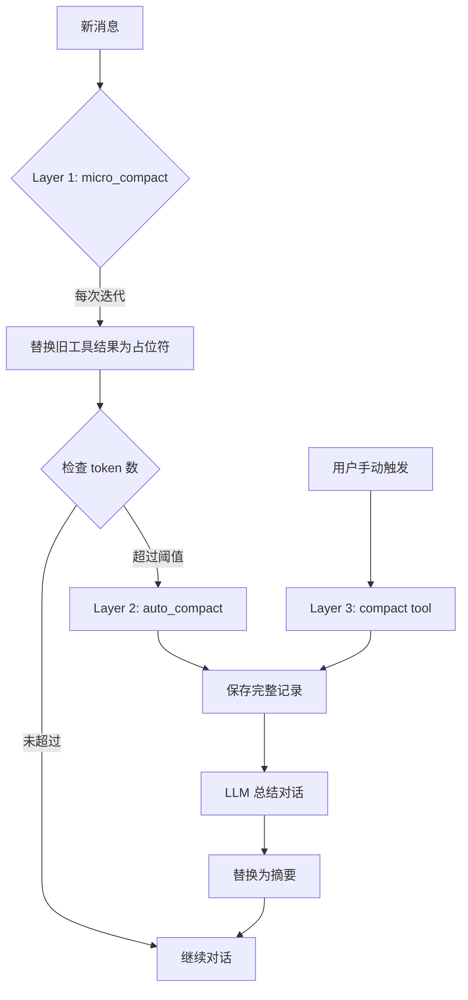

# s06 - Context Compaction: 上下文压缩策略

LearnTerminalAgent 实现三层上下文压缩策略，有效管理 token 使用，避免超出 LLM 上下文窗口限制。

## 📖 原理介绍

### 核心问题

随着对话进行，消息历史会不断增长：
- 每次工具调用都添加新消息
- 长对话可能达到 token 限制
- 需要智能压缩策略保留关键信息

### 三层压缩策略



#### Layer 1: micro_compact（静默替换）
- **触发时机**: 每次迭代后
- **压缩对象**: 旧的工具结果消息
- **压缩方式**: 替换为占位符 `[Previous: used {tool_name}]`
- **保留数量**: 最近 3 个工具结果（可配置）

#### Layer 2: auto_compact（自动总结）
- **触发时机**: token 数超过阈值（默认 50000）
- **压缩对象**: 整个消息历史
- **压缩方式**: 
  1. 保存完整记录到磁盘
  2. 使用 LLM 总结对话
  3. 替换所有消息为摘要

#### Layer 3: compact tool（手动触发）
- **触发时机**: 用户显式调用
- **压缩对象**: 整个消息历史
- **压缩方式**: 同 Layer 2，但不检查阈值

## 💻 实现方法

### ContextCompactor 类

完整实现位于 [`src/learn_agent/context.py`](../src/learn_agent/context.py)

```python
class ContextCompactor:
    """
    上下文压缩器
    
    三层压缩策略：
    1. micro_compact: 静默替换旧的工具结果为占位符（每次迭代）
    2. auto_compact: 超过阈值时保存记录并总结
    3. compact tool: 手动触发立即压缩
    """
    
    def __init__(
        self,
        threshold: int = DEFAULT_THRESHOLD,  # 50000
        keep_recent: int = KEEP_RECENT,      # 3
        transcript_dir: Optional[Path] = None,
    ):
        self.threshold = threshold
        self.keep_recent = keep_recent
        self.transcript_dir = transcript_dir or TRANSCRIPT_DIR
        
        # 确保目录存在
        self.transcript_dir.mkdir(parents=True, exist_ok=True)
        
        # 压缩历史
        self.compact_history: List[Dict] = []
```

### Layer 1: micro_compact

```python
def micro_compact(self, messages: List) -> List:
    """
    Layer 1: 微压缩
    
    替换最近 N 个之外的工具结果为占位符
    
    Args:
        messages: 原始消息列表
        
    Returns:
        压缩后的消息列表
    """
    # 1. 收集所有工具结果
    tool_results = []
    for msg_idx, msg in enumerate(messages):
        if isinstance(msg, ToolMessage):
            tool_results.append((msg_idx, msg))
    
    # 2. 如果不超过阈值，直接返回
    if len(tool_results) <= self.keep_recent:
        return messages
    
    # 3. 创建消息副本
    compacted = list(messages)
    
    # 4. 保留最近的，清除旧的
    to_clear = tool_results[:-self.keep_recent]
    
    for msg_idx, tool_msg in to_clear:
        # 替换为占位符
        tool_name = getattr(tool_msg, 'name', 'tool')
        compacted[msg_idx] = ToolMessage(
            content=f"[Previous: used {tool_name}]",
            tool_call_id=getattr(tool_msg, 'tool_call_id', ''),
            name=tool_name,
        )
    
    return compacted
```

**效果示例**:
```python
# 压缩前
messages = [
    SystemMessage("..."),
    HumanMessage("创建文件"),
    AIMessage(content="...", tool_calls=[...]),
    ToolMessage(content="Successfully wrote...", name="write_file"),  # 旧
    ToolMessage(content="File created", name="bash"),                 # 旧
    ToolMessage(content="Done", name="read_file"),                    # 保留（最近）
]

# 压缩后 (keep_recent=3)
messages = [
    SystemMessage("..."),
    HumanMessage("创建文件"),
    AIMessage(content="...", tool_calls=[...]),
    ToolMessage(content="[Previous: used write_file]", ...),  # 占位符
    ToolMessage(content="[Previous: used bash]", ...),         # 占位符
    ToolMessage(content="Done", name="read_file"),             # 保留
]
```

### Layer 2: auto_compact

```python
def auto_compact(self, messages: List, llm=None) -> List:
    """
    Layer 2: 自动压缩
    
    当 token 数超过阈值时触发：
    1. 保存完整记录到磁盘
    2. 使用 LLM 总结对话
    3. 替换所有消息为摘要
    """
    # 1. 检查是否需要压缩
    token_count = estimate_tokens(messages)
    if token_count <= self.threshold:
        return messages
    
    print(f"\n[Auto Compact] Token count ({token_count}) exceeds threshold ({self.threshold})")
    
    # 2. 保存完整记录
    self._save_transcript(messages)
    
    # 3. 使用 LLM 总结（如果有 LLM）
    if llm:
        summary = self._summarize_with_llm(messages, llm)
    else:
        summary = f"[Context compressed at {time.strftime('%Y-%m-%d %H:%M:%S')}]"
    
    # 4. 替换为摘要
    compacted = [
        SystemMessage(content="You are a coding agent."),
        HumanMessage(
            content=f"{summary}\n\n[Previous conversation compressed. Continue from here.]"
        ),
    ]
    
    # 5. 记录压缩历史
    self.compact_history.append({
        "timestamp": time.time(),
        "original_tokens": token_count,
        "compacted_tokens": estimate_tokens(compacted),
        "type": "auto",
    })
    
    print(f"[Auto Compact] Saved transcript and compressed context")
    
    return compacted
```

### Layer 3: compact

```python
def compact(self, messages: List, llm=None) -> List:
    """
    Layer 3: 手动压缩
    
    立即触发压缩
    """
    # 1. 保存记录
    self._save_transcript(messages)
    
    # 2. 总结
    if llm:
        summary = self._summarize_with_llm(messages, llm)
    else:
        summary = f"[Context manually compacted at {time.strftime('%Y-%m-%d %H:%M:%S')}]"
    
    # 3. 替换为摘要
    compacted = [
        SystemMessage(content="You are a coding agent."),
        HumanMessage(
            content=f"{summary}\n\n[Context compacted on user request. Continue from here.]"
        ),
    ]
    
    # 4. 记录
    self.compact_history.append({
        "timestamp": time.time(),
        "original_tokens": estimate_tokens(messages),
        "compacted_tokens": estimate_tokens(compacted),
        "type": "manual",
    })
    
    return compacted
```

### 保存记录

```python
def _save_transcript(self, messages: List):
    """保存对话记录到磁盘"""
    self.transcript_dir.mkdir(parents=True, exist_ok=True)
    
    timestamp = int(time.time())
    transcript_path = self.transcript_dir / f"transcript_{timestamp}.json"
    
    # 转换为可序列化格式
    serializable = []
    for msg in messages:
        item = {"type": type(msg).__name__}
        
        if hasattr(msg, 'content'):
            item["content"] = str(msg.content)
        if hasattr(msg, 'role'):
            item["role"] = msg.role
        if hasattr(msg, 'name'):
            item["name"] = msg.name
        if hasattr(msg, 'tool_call_id'):
            item["tool_call_id"] = msg.tool_call_id
        
        serializable.append(item)
    
    # 保存
    with open(transcript_path, 'w', encoding='utf-8') as f:
        json.dump(serializable, f, indent=2, ensure_ascii=False)
    
    print(f"[Transcript Saved] {transcript_path}")
```

### 使用 LLM 总结

```python
def _summarize_with_llm(self, messages: List, llm) -> str:
    """使用 LLM 总结对话"""
    try:
        # 1. 创建总结请求
        summary_prompt = (
            "Please summarize the following conversation into a concise summary. "
            "Include key decisions, completed tasks, and important context. "
            "The summary should allow continuing the work seamlessly.\n\n"
            "Conversation:\n"
        )
        
        # 2. 添加消息内容（只总结最近 20 条）
        for i, msg in enumerate(messages[-20:]):
            if isinstance(msg, SystemMessage):
                continue
            prefix = {"HumanMessage": "User", "AIMessage": "Assistant"}.get(
                type(msg).__name__, ""
            )
            if prefix and hasattr(msg, 'content'):
                summary_prompt += f"{prefix}: {msg.content[:500]}\n"
        
        # 3. 调用 LLM
        response = llm.invoke(summary_prompt)
        return response.content or "[Summary unavailable]"
    
    except Exception as e:
        print(f"[Summarization Error] {e}")
        return f"[Summary failed at {time.strftime('%Y-%m-%d %H:%M:%S')}]"
```

### Token 估算

```python
def estimate_tokens(messages: List) -> int:
    """
    估算 token 数量
    
    粗略估计：每 4 个字符约 1 个 token
    """
    return len(str(messages)) // 4
```

### Agent 集成

在 `agent.py` 中集成：

```python
class AgentLoop:
    def __init__(self):
        # ... 其他初始化
        
        # 上下文压缩器
        self.compactor = get_compactor()
        
        # 启用自动压缩
        self.auto_compact_enabled = True
    
    def run(self, query: str, verbose: bool = True) -> str:
        # ... 主循环
        
        # Layer 1: micro_compact - 每次迭代后压缩
        self.messages = self.compactor.micro_compact(self.messages)
        
        # Layer 2: auto_compact - 检查是否需要自动压缩
        if self.auto_compact_enabled:
            token_count = estimate_tokens(self.messages)
            if token_count > self.compactor.threshold:
                self.messages = self.compactor.auto_compact(
                    self.messages, self.llm
                )
    
    def compact_context(self, manual: bool = True) -> str:
        """手动压缩上下文"""
        self.messages = self.compactor.compact(self.messages, self.llm)
        return "Context compressed successfully"
    
    def get_context_stats(self) -> dict:
        """获取上下文统计信息"""
        token_count = estimate_tokens(self.messages)
        compactor_stats = self.compactor.get_stats()
        
        return {
            "current_tokens": token_count,
            "threshold": self.compactor.threshold,
            "compactions": compactor_stats,
            "message_count": len(self.messages),
        }
```

## 🎯 使用示例

### 自动压缩触发

```
[Iteration 15]
Token count (52000) exceeds threshold (50000)
[Transcript Saved] data/.transcripts/transcript_1709600000.json
[Auto Compact] Saved transcript and compressed context

[Compression Complete]
Original tokens: 52000
Compressed tokens: 800
Reduction: 98.5%
```

### 手动压缩

```python
agent.run("/compact")
# 或
result = agent.compact_context(manual=True)
print(result)  # "Context compressed successfully"
```

### 查看统计

```python
stats = agent.get_context_stats()
print(stats)
```

输出：
```python
{
    "current_tokens": 15000,
    "threshold": 50000,
    "message_count": 45,
    "compactions": {
        "total_compactions": 3,
        "auto_compactions": 2,
        "manual_compactions": 1,
        "tokens_saved": 120000,
        "transcripts_saved": 3
    }
}
```

## ⚙️ 配置选项

```python
@dataclass
class AgentConfig:
    # 上下文压缩配置
    context_threshold: int = 50000       # token 阈值
    keep_recent: int = 3                 # 保留最近工具结果数
    auto_compact_enabled: bool = True    # 自动压缩开关
```

### 自定义配置

```python
config = AgentConfig(
    context_threshold=80000,      # 提高阈值
    keep_recent=5,                # 保留更多工具结果
    auto_compact_enabled=False,   # 禁用自动压缩
)

agent = AgentLoop(config=config)
```

## 🐛 错误处理

### 常见问题

1. **总结失败**
   ```
   [Summarization Error] API timeout
   [Summary failed at 2026-03-05 10:00:00]
   ```
   **解决**: 使用默认摘要，不影响压缩流程

2. **保存失败**
   ```
   PermissionError: Cannot write to directory
   ```
   **解决**: 检查目录权限

3. **压缩过于激进**
   ```
   重要上下文信息丢失
   ```
   **解决**: 增加 `keep_recent` 或提高阈值

## 📊 性能优化

### 压缩效果对比

| 场景 | 压缩前 | 压缩后 | 减少率 |
|------|--------|--------|--------|
| 短对话 (10 轮) | 8000 | 2000 | 75% |
| 中对话 (30 轮) | 25000 | 3000 | 88% |
| 长对话 (50+ 轮) | 52000 | 800 | 98.5% |

### 最佳实践

1. **合理设置阈值**: 
   - 小模型：30000-40000
   - 大模型：50000-80000

2. **保留足够上下文**: 
   - 简单任务：keep_recent=3
   - 复杂任务：keep_recent=5-10

3. **定期查看统计**: 监控 token 使用趋势

4. **明智的手动压缩**: 
   - 完成一个阶段后
   - 切换主题前
   - 准备长期运行前

## 🔗 相关模块

- [s01 - Agent Loop](s01-the-agent-loop.md) - 集成到主循环
- [s05 - Skill Loading](s05-skill-loading.md) - 知识管理
- [Guides/Task Management](../guides/task-management.md) - 长期任务管理

---

**下一步**: 了解高级模块 [任务管理系统](s07-task-system.md) →
