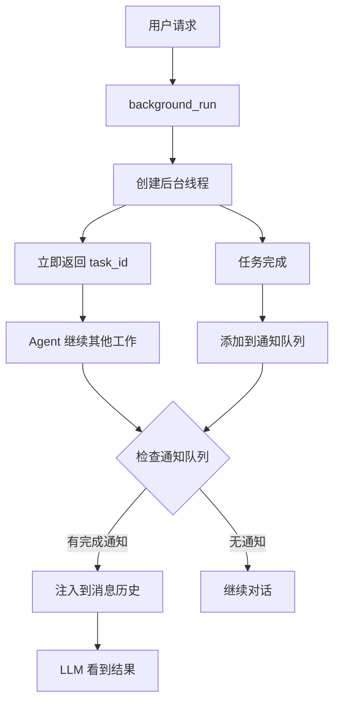

# s08 - Background Tasks: 后台任务机制

LearnAgent 支持在后台线程中执行长时间运行的任务，通过通知队列将结果注入到 Agent 循环中。

## 📖 原理介绍

### 核心问题

某些任务耗时较长（如 `npm install`、编译大型项目等），如果在前台执行会：
- 阻塞 Agent 循环
- 无法执行其他操作
- 用户体验差

### 解决方案

**后台任务机制**：
1. 在独立线程中运行命令（非阻塞）
2. 使用通知队列传递完成结果
3. 在下次 LLM 调用前注入结果到消息历史

### 工作流程



### 关键特性

1. **非阻塞执行** - 立即返回，不等待任务完成
2. **通知队列** - 已完成任务的结果暂存区
3. **自动注入** - 在 LLM 调用前自动注入通知
4. **状态查询** - 可以随时检查任务状态

## 💻 实现方法

### BackgroundManager 类

完整实现位于 [`src/learn_agent/background.py`](../src/learn_agent/background.py)

```python
class BackgroundManager:
    """
    后台任务管理器
    
    使用线程在后台执行命令，通过通知队列传递结果
    """
    
    def __init__(self):
        self.tasks: Dict[str, dict] = {}  # task_id -> {status, result, command}
        self._notification_queue: List[dict] = []  # 已完成任务的结果
        self._lock = threading.Lock()  # 线程锁保护通知队列
```

### 核心方法

#### 1. 运行后台任务

```python
def run(self, command: str) -> str:
    """
    启动后台任务
    
    Args:
        command: 要执行的命令
        
    Returns:
        任务 ID
    """
    task_id = str(uuid.uuid4())[:8]  # 生成唯一 ID
    self.tasks[task_id] = {
        "status": "running",
        "result": None,
        "command": command,
    }
    
    # 创建并启动线程
    thread = threading.Thread(
        target=self._execute,
        args=(task_id, command),
        daemon=True,  # 守护线程，主程序退出时自动终止
    )
    thread.start()
    
    return f"Background task {task_id} started: {command[:80]}"
```

**使用示例**:
```python
manager.run("npm install")
# 输出：Background task a1b2c3d4 started: npm install
```

#### 2. 执行逻辑（在线程中）

```python
def _execute(self, task_id: str, command: str):
    """
    执行后台任务（在线程中运行）
    
    Args:
        task_id: 任务 ID
        command: 命令
    """
    try:
        # 执行命令
        r = subprocess.run(
            command,
            shell=True,
            cwd=os.getcwd(),
            capture_output=True,
            text=True,
            timeout=300,  # 5 分钟超时
        )
        output = (r.stdout + r.stderr).strip()[:50000]
        status = "completed"
        
    except subprocess.TimeoutExpired:
        output = "Error: Timeout (300s)"
        status = "timeout"
        
    except Exception as e:
        output = f"Error: {e}"
        status = "error"
    
    # 更新任务状态
    self.tasks[task_id]["status"] = status
    self.tasks[task_id]["result"] = output or "(no output)"
    
    # 添加到通知队列（线程安全）
    with self._lock:
        self._notification_queue.append({
            "task_id": task_id,
            "status": status,
            "command": command[:80],
            "result": (output or "(no output)")[:500],
        })
```

#### 3. 检查任务状态

```python
def check(self, task_id: Optional[str] = None) -> str:
    """
    检查任务状态
    
    Args:
        task_id: 任务 ID（可选，不提供则列出所有）
        
    Returns:
        任务状态信息
    """
    if task_id:
        # 检查特定任务
        t = self.tasks.get(task_id)
        if not t:
            return f"Error: Unknown task {task_id}"
        result = t.get('result') or '(running)'
        return f"[{t['status']}] {t['command'][:60]}\n{result}"
    
    # 列出所有任务
    lines = []
    for tid, t in self.tasks.items():
        lines.append(f"{tid}: [{t['status']}] {t['command'][:60]}")
    return "\n".join(lines) if lines else "No background tasks."
```

**使用示例**:
```python
# 检查特定任务
manager.check("a1b2c3d4")
# 输出：[completed] npm install
#       Added 150 packages in 15s

# 列出所有任务
manager.check()
# 输出：
# a1b2c3d4: [completed] npm install
# e5f6g7h8: [running] python build.py
```

#### 4. 排出通知

```python
def drain_notifications(self) -> List[dict]:
    """
    返回并清空所有待处理的通知
    
    Returns:
        通知列表
    """
    with self._lock:
        notifs = list(self._notification_queue)
        self._notification_queue.clear()
    return notifs
```

**通知格式**:
```python
{
    "task_id": "a1b2c3d4",
    "status": "completed",
    "command": "npm install",
    "result": "Added 150 packages..."
}
```

### 工具定义

两个 LangChain 工具：

```python
@tool
def background_run(command: str) -> str:
    """
    在后台运行命令（非阻塞）
    
    Args:
        command: 要执行的命令
        
    Returns:
        任务 ID
    """
    manager = get_bg_manager()
    return manager.run(command)

@tool
def check_background(task_id: Optional[str] = None) -> str:
    """
    检查后台任务状态
    
    Args:
        task_id: 任务 ID（可选，不提供则列出所有）
        
    Returns:
        任务状态
    """
    manager = get_bg_manager()
    return manager.check(task_id)
```

### Agent 集成

在 `agent.py` 中的集成点：

```python
class AgentLoop:
    def __init__(self):
        # ... 其他初始化
        
        # 处理后台任务通知
        self._process_background_notifications()
    
    def _process_background_notifications(self):
        """处理后台任务通知并注入到消息历史"""
        notifs = drain_bg_notifications()
        if notifs and len(self.messages) > 1:
            notif_text = "\n".join(
                f"[bg:{n['task_id']}] {n['status']}: {n['result']}" 
                for n in notifs
            )
            self.messages.append(
                HumanMessage(
                    content=f"<background-results>\n{notif_text}\n</background-results>"
                )
            )
            self.messages.append(
                AIMessage(content="Noted background results.")
            )
    
    def check_background(self, task_id: Optional[str] = None) -> str:
        """检查后台任务状态"""
        from .background import get_bg_manager
        return get_bg_manager().check(task_id)
    
    def reset_background(self):
        """重置后台管理器"""
        reset_background()
```

### 全局实例

```python
# 全局后台管理器实例
_bg_manager: Optional[BackgroundManager] = None

def get_bg_manager() -> BackgroundManager:
    """获取全局后台管理器"""
    global _bg_manager
    if _bg_manager is None:
        _bg_manager = BackgroundManager()
    return _bg_manager

def reset_background():
    """重置后台管理器"""
    global _bg_manager
    _bg_manager = BackgroundManager()

def drain_bg_notifications() -> List[dict]:
    """排出后台通知"""
    manager = get_bg_manager()
    return manager.drain_notifications()
```

## 🎯 使用示例

### 基础使用

```python
# 1. 启动后台任务
agent.background_run("npm install")
# 输出：Background task a1b2c3d4 started: npm install

# 2. 继续做其他事情
agent.run("查看 package.json 的内容")

# 3. 检查任务状态
agent.check_background("a1b2c3d4")
# 输出：[completed] npm install
#       Added 150 packages in 15s
```

### 实际工作流

```
用户：安装依赖并构建项目

Agent 执行流程:
1. background_run("npm install")
   → 立即返回，开始后台安装
   
2. 同时可以做其他事情:
   - 读取 README.md
   - 分析项目结构
   - 编写代码
   
3. 安装完成后，通知自动注入:
   <background-results>
   [bg:a1b2c3d4] completed: Added 150 packages...
   </background-results>
   
4. Agent 看到通知后继续:
   background_run("npm run build")
```

### 多任务并发

```python
# 同时启动多个后台任务
agent.background_run("npm install")      # task_abc
agent.background_run("python lint.py")   # task_def
agent.background_run("docker build .")   # task_ghi

# 检查所有任务状态
agent.check_background()
# 输出:
# abc: [completed] npm install
# def: [running] python lint.py
# ghi: [running] docker build .

# 等待一段时间后再次检查
agent.check_background("def")
# 输出：[completed] python lint.py
#       No lint errors found
```

### 错误处理

```python
# 启动会失败的任务
agent.background_run("python nonexistent.py")

# 检查结果
result = agent.check_background("task_id")
# 输出：[error] python nonexistent.py
#       Error: FileNotFoundError: [Errno 2] No such file...

# 超时任务
agent.background_run("sleep 600")  # 超过 300 秒超时

result = agent.check_background("task_id")
# 输出：[timeout] sleep 600
#       Error: Timeout (300s)
```

## ⚙️ 配置选项

### 超时时间

硬编码为 300 秒（5 分钟）：

```python
subprocess.run(command, timeout=300)
```

可以修改源码调整：

```python
# 在 background.py 中修改
BG_TIMEOUT = 600  # 10 分钟
```

### 输出长度限制

```python
output = (r.stdout + r.stderr).strip()[:50000]
```

### 通知结果预览

```python
"result": (output or "(no output)")[:500]
```

## 🐛 错误处理

### 常见错误

1. **未知任务 ID**
   ```
   Error: Unknown task a1b2c3d4
   ```
   **解决**: 检查 task_id 是否正确

2. **命令执行失败**
   ```
   [error] python script.py
   FileNotFoundError: ...
   ```
   **解决**: 检查命令和文件路径

3. **超时**
   ```
   [timeout] long_running_command
   Error: Timeout (300s)
   ```
   **解决**: 增加超时时间或优化命令

4. **通知未注入**
   ```
   任务完成但 Agent 不知道
   ```
   **解决**: 确保 `_process_background_notifications()` 被调用

## 📊 性能考虑

### 优势

✅ **非阻塞** - Agent 可以继续其他工作  
✅ **并发执行** - 可以同时运行多个任务  
✅ **自动通知** - 完成后自动告知 Agent  
✅ **状态可查** - 随时检查任务进度  

### 劣势

⚠️ **线程开销** - 每个任务占用一个线程  
⚠️ **内存占用** - 任务信息保存在内存中  
⚠️ **无优先级** - 所有任务平等对待  

### 最佳实践

1. **合理使用后台任务** - 仅长时间任务使用后台模式
2. **及时检查结果** - 主动或被动检查任务状态
3. **避免过多并发** - 同时运行 3-5 个任务为宜
4. **设置合理超时** - 根据任务类型调整超时时间
5. **清理完成任务** - 定期重置后台管理器

## 🔗 与相关模块集成

### 与 Agent 循环集成

每次迭代前检查通知：

```python
def run(self, query: str, verbose: bool = True) -> str:
    # 主循环
    while True:
        # ... LLM 调用
        
        # 添加工具结果后
        self.messages = self.compactor.micro_compact(self.messages)
        
        # 处理后台任务通知
        self._process_background_notifications()
```

### 与 Task System 集成 (s07)

```python
# 创建任务并绑定后台任务
agent.task_create("安装依赖")
task_id = agent.background_run("npm install")
# 可以将 task_id 记录在任务描述中
```

### 与团队协作集成 (s09)

```python
# 队友执行后台任务
agent.send_message("builder", "开始构建项目")
agent.background_run("npm run build")

# 完成后通知队友
agent.send_message("builder", "构建完成，请检查结果")
```

## 🔗 相关模块

- [s01 - Agent Loop](s01-the-agent-loop.md) - 通知注入机制
- [s07 - Task System](s07-task-system.md) - 任务管理
- [s09 - Agent Teams](s09-agent-teams.md) - 团队协作

---

**下一步**: 了解 [团队协作机制](s09-agent-teams.md) →
