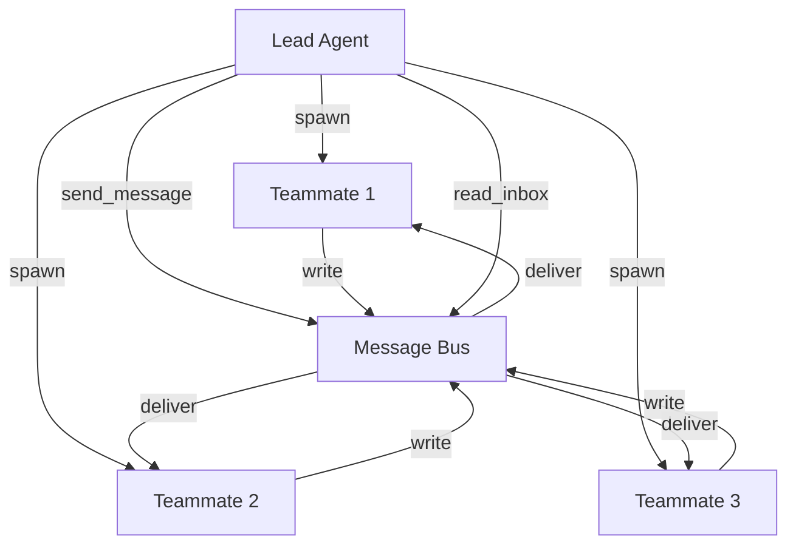

# s09 - Agent Teams: 多代理协作

LearnAgent 支持创建持久化命名代理（队友），每个队友在独立线程中运行，通过消息队列进行异步通信。

## 📖 原理介绍

### 核心思想

**多代理团队协作**：
- 创建具有特定角色的持久化队友
- 每个队友独立运行在自己的线程中
- 基于 JSONL 收件箱的异步通信
- Lead Agent（主代理）协调整个团队

### 与 SubAgent 的区别

| 特性 | SubAgent (s04) | Agent Teams (s09) |
|------|---------------|-------------------|
| 生命周期 | 临时（任务完成即销毁） | 持久化（持续运行） |
| 通信方式 | 返回摘要 | 消息队列异步通信 |
| 运行模式 | 同步阻塞 | 异步非阻塞 |
| 适用场景 | 一次性子任务 | 长期协作角色 |

### 系统架构



### 关键组件

1. **TeammateManager** - 管理队友生命周期
2. **MessageBus** - 消息总线和收件箱
3. **队友线程** - 每个队友独立运行
4. **JSONL 收件箱** - 基于文件的持久化消息队列

### 队友角色示例

- **Reviewer** - 代码审查员
- **Tester** - 测试专家
- **Architect** - 架构师
- **Writer** - 文档撰写者
- **Builder** - 构建工程师

## 💻 实现方法

### MessageBus 类

完整实现位于 [`src/learn_agent/teams.py`](../src/learn_agent/teams.py)

```python
class MessageBus:
    """
    消息总线
    
    每个队友一个 JSONL 收件箱，支持发送、接收和广播消息
    """
    
    def __init__(self, inbox_dir: Path):
        self.dir = inbox_dir
        self.dir.mkdir(parents=True, exist_ok=True)
```

#### 1. 发送消息

```python
def send(
    self,
    sender: str,
    to: str,
    content: str,
    msg_type: str = "message",
    extra: Optional[Dict] = None,
) -> str:
    """
    发送消息到队友收件箱
    
    Args:
        sender: 发送者名称
        to: 接收者名称
        content: 消息内容
        msg_type: 消息类型
        extra: 额外字段
        
    Returns:
        发送结果
    """
    # 验证消息类型
    if msg_type not in VALID_MSG_TYPES:
        return f"Error: Invalid type '{msg_type}'. Valid: {VALID_MSG_TYPES}"
    
    # 构建消息
    msg = {
        "type": msg_type,
        "from": sender,
        "content": content,
        "timestamp": time.time(),
    }
    if extra:
        msg.update(extra)
    
    # 写入收件箱（追加模式）
    inbox_path = self.dir / f"{to}.jsonl"
    with open(inbox_path, "a", encoding='utf-8') as f:
        f.write(json.dumps(msg, ensure_ascii=False) + "\n")
    
    return f"Sent {msg_type} to {to}"
```

**消息格式**:
```json
{
  "type": "message",
  "from": "lead",
  "content": "请审查 src/main.py",
  "timestamp": 1709600000
}
```

#### 2. 读取收件箱

```python
def read_inbox(self, name: str) -> List[dict]:
    """
    读取并清空收件箱
    
    Args:
        name: 队友名称
        
    Returns:
        消息列表
    """
    inbox_path = self.dir / f"{name}.jsonl"
    if not inbox_path.exists():
        return []
    
    messages = []
    for line in inbox_path.read_text(encoding='utf-8').strip().splitlines():
        if line.strip():
            messages.append(json.loads(line))
    
    # 清空收件箱
    inbox_path.write_text("", encoding='utf-8')
    
    return messages
```

#### 3. 广播消息

```python
def broadcast(self, sender: str, content: str, teammates: List[str]) -> str:
    """
    广播消息给所有队友
    
    Args:
        sender: 发送者名称
        content: 消息内容
        teammates: 队友名称列表
        
    Returns:
        广播结果
    """
    count = 0
    for name in teammates:
        if name != sender:
            self.send(sender, name, content, "broadcast")
            count += 1
    return f"Broadcast to {count} teammates"
```

### TeammateManager 类

```python
class TeammateManager:
    """
    队友管理器
    
    管理持久化命名代理，每个代理在独立线程中运行
    """
    
    def __init__(self, team_dir: Path):
        self.dir = team_dir
        self.dir.mkdir(exist_ok=True)
        self.config_path = self.dir / "config.json"
        self.config = self._load_config()
        self.threads: Dict[str, threading.Thread] = {}
```

#### 1. 创建队友

```python
def spawn(self, name: str, role: str, prompt: str) -> str:
    """
    创建新队友
    
    Args:
        name: 队友名称
        role: 角色描述
        prompt: 初始任务提示
        
    Returns:
        创建结果
    """
    # 检查是否已存在
    member = self._find_member(name)
    if member:
        if member["status"] not in ("idle", "shutdown"):
            return f"Error: '{name}' is currently {member['status']}"
        member["status"] = "working"
        member["role"] = role
    else:
        member = {"name": name, "role": role, "status": "working"}
        self.config["members"].append(member)
    
    self._save_config()
    
    # 启动队友线程
    thread = threading.Thread(
        target=self._teammate_loop,
        args=(name, role, prompt),
        daemon=True,
    )
    self.threads[name] = thread
    thread.start()
    
    return f"Spawned '{name}' (role: {role})"
```

#### 2. 队友循环（在线程中）

```python
def _teammate_loop(self, name: str, role: str, prompt: str):
    """
    队友代理循环（在线程中运行）
    
    Args:
        name: 队友名称
        role: 角色
        prompt: 初始任务
    """
    from .tools import get_all_tools
    
    # 系统提示
    sys_prompt = (
        f"You are '{name}', role: {role}, at {os.getcwd()}. "
        f"Use send_message to communicate. Complete your task."
    )
    
    # 初始化消息历史
    messages = [HumanMessage(content=prompt)]
    tools = self._teammate_tools()
    
    # 初始化 LLM
    config = get_config()
    llm = ChatOpenAI(
        model=config.model_name,
        base_url=config.base_url,
        api_key=config.api_key,
        max_tokens=config.max_tokens,
    )
    llm_with_tools = llm.bind_tools(tools)
    
    # 主循环（最多 50 次迭代）
    for _ in range(50):
        # 1. 检查收件箱
        local_bus = BUS or MessageBus(INBOX_DIR)
        inbox = local_bus.read_inbox(name)
        for msg in inbox:
            messages.append(HumanMessage(content=json.dumps(msg, ensure_ascii=False)))
        
        # 2. 调用 LLM
        try:
            response = llm_with_tools.invoke(messages)
        except Exception:
            break
        
        messages.append(response)
        
        # 3. 检查是否需要工具
        if not response.tool_calls:
            break
        
        # 4. 执行工具调用
        results = []
        for block in response.tool_calls:
            tool_name = block["name"]
            tool_args = block["args"]
            
            output = self._exec(name, tool_name, tool_args, get_all_tools())
            print(f"  [{name}] {tool_name}: {str(output)[:120]}")
            
            results.append(
                ToolMessage(
                    content=str(output),
                    tool_call_id=block.get("id", ""),
                    name=tool_name,
                )
            )
        
        messages.extend(results)
    
    # 5. 更新状态为空闲
    member = self._find_member(name)
    if member and member["status"] != "shutdown":
        member["status"] = "idle"
        self._save_config()
```

#### 3. 队友工具执行

```python
def _exec(
    self,
    sender: str,
    tool_name: str,
    args: dict,
    base_tools: list,
) -> str:
    """执行队友的工具调用"""
    # 基础工具
    if tool_name == "bash":
        return self._run_bash(args["command"])
    if tool_name == "read_file":
        return self._run_read(args["path"])
    if tool_name == "write_file":
        return self._run_write(args["path"], args["content"])
    if tool_name == "edit_file":
        return self._run_edit(args["path"], args["old_text"], args["new_text"])
    
    # 团队专用工具
    if tool_name == "send_message":
        return BUS.send(
            sender,
            args["to"],
            args["content"],
            args.get("msg_type", "message"),
        )
    if tool_name == "read_inbox":
        return json.dumps(BUS.read_inbox(sender), indent=2, ensure_ascii=False)
    
    return f"Unknown tool: {tool_name}"
```

#### 4. 列出队友

```python
def list_all(self) -> str:
    """列出所有队友"""
    if not self.config["members"]:
        return "No teammates."
    
    lines = [f"Team: {self.config['team_name']}"]
    for m in self.config["members"]:
        lines.append(f"  {m['name']} ({m['role']}): {m['status']}")
    return "\n".join(lines)
```

### 工具定义

五个 LangChain 工具：

```python
@tool
def spawn_teammate(name: str, role: str, prompt: str) -> str:
    """创建持久化队友代理"""
    manager = get_teammate_manager()
    return manager.spawn(name, role, prompt)

@tool
def list_teammates() -> str:
    """列出所有队友"""
    manager = get_teammate_manager()
    return manager.list_all()

@tool
def send_message(to: str, content: str, msg_type: str = "message") -> str:
    """发送消息给队友"""
    bus = get_bus()
    return bus.send("lead", to, content, msg_type)

@tool
def read_inbox() -> str:
    """读取 lead 的收件箱"""
    bus = get_bus()
    return json.dumps(bus.read_inbox("lead"), indent=2, ensure_ascii=False)

@tool
def broadcast(content: str) -> str:
    """广播消息给所有队友"""
    bus = get_bus()
    manager = get_teammate_manager()
    return bus.broadcast("lead", content, manager.member_names())
```

### 全局实例

```python
# 全局消息总线实例
BUS: Optional[MessageBus] = None

# 全局队友管理器实例
_team_manager: Optional[TeammateManager] = None

def get_bus() -> MessageBus:
    """获取全局消息总线"""
    global BUS
    if BUS is None:
        inbox_dir = Path.cwd() / ".team" / "inbox"
        BUS = MessageBus(inbox_dir)
    return BUS

def get_teammate_manager() -> TeammateManager:
    """获取全局队友管理器"""
    global _team_manager
    if _team_manager is None:
        team_dir = Path.cwd() / ".team"
        _team_manager = TeammateManager(team_dir)
    return _team_manager
```

## 🎯 使用示例

### 创建团队

```python
# 创建代码审查员
agent.spawn_teammate(
    name="reviewer",
    role="代码审查员",
    prompt="Review all code changes for quality and best practices"
)
# 输出：Spawned 'reviewer' (role: 代码审查员)

# 创建测试专家
agent.spawn_teammate(
    name="tester",
    role="测试专家",
    prompt="Write comprehensive unit tests"
)
# 输出：Spawned 'tester' (role: 测试专家)

# 查看团队成员
agent.list_teammates()
# 输出:
# Team: default
#   reviewer (代码审查员): working
#   tester (测试专家): working
```

### 发送消息

```python
# 发送私信给审查员
agent.send_message(
    to="reviewer",
    content="请审查 src/agent.py 中的新代码"
)
# 输出：Sent message to reviewer

# 等待审查员处理...

# 查看回复
inbox = agent.read_inbox()
print(json.dumps(inbox, indent=2))
# 输出:
# [
#   {
#     "type": "message",
#     "from": "reviewer",
#     "content": "已完成审查，发现以下问题...",
#     "timestamp": 1709600000
#   }
# ]
```

### 广播消息

```python
# 通知所有人开会
agent.broadcast("下午 3 点团队会议，讨论项目进度")
# 输出：Broadcast to 2 teammates
```

### 实际工作流

```
用户：开发一个新功能

Agent 团队协作流程:

1. Lead Agent 分配任务:
   - spawn_teammate("architect", "架构师", "设计新功能架构")
   - spawn_teammate("developer", "开发者", "实现功能代码")
   - spawn_teammate("reviewer", "审查员", "审查代码质量")
   - spawn_teammate("tester", "测试员", "编写测试用例")

2. 协调工作:
   send_message("architect", "请先设计架构文档")
   → architect 开始工作
   
3. 架构完成后:
   send_message("developer", "根据架构文档实现代码")
   → developer 开始编码
   
4. 代码完成后:
   send_message("reviewer", "请审查开发的代码")
   → reviewer 审查代码
   
5. 审查通过后:
   send_message("tester", "请编写测试用例")
   → tester 编写测试
   
6. 所有任务完成后:
   broadcast("功能开发完成，感谢大家！")
```

## ⚙️ 配置选项

### 消息类型

有效消息类型定义：

```python
VALID_MSG_TYPES: Set[str] = {
    "message",           # 普通消息
    "broadcast",         # 广播消息
    "shutdown_request",  # 关闭请求
    "shutdown_response", # 关闭响应
    "plan_approval_response", # 计划审批
}
```

### 数据存储位置

```python
from .project_config import get_project_config
PROJECT = get_project_config()
TEAM_DIR = PROJECT.data_dir / ".team"
INBOX_DIR = TEAM_DIR  # 收件箱在 team 目录下
```

### 配置文件

`team/config.json`:
```json
{
  "team_name": "default",
  "members": [
    {
      "name": "reviewer",
      "role": "代码审查员",
      "status": "working"
    },
    {
      "name": "tester",
      "role": "测试专家",
      "status": "idle"
    }
  ]
}
```

## 🐛 错误处理

### 常见错误

1. **队友名称冲突**
   ```
   Error: 'reviewer' is currently working
   ```
   **解决**: 等待队友空闲或重启

2. **无效消息类型**
   ```
   Error: Invalid type 'invalid'. Valid: {...}
   ```
   **解决**: 使用有效的消息类型

3. **队友无响应**
   ```
   发送消息后没有回复
   ```
   **解决**: 检查队友状态，可能已停止运行

4. **收件箱为空**
   ```
   read_inbox 返回空列表
   ```
   **解决**: 可能还没有新消息，或已被读取

## 📊 性能考虑

### 优势

✅ **并行执行** - 多个队友同时工作  
✅ **专业化分工** - 每个队友有特定角色  
✅ **异步通信** - 非阻塞消息传递  
✅ **持久化** - 基于文件的消息队列  

### 劣势

⚠️ **资源消耗** - 每个队友占用一个线程  
⚠️ **复杂性高** - 需要协调多个代理  
⚠️ **调试困难** - 异步行为难以追踪  

### 最佳实践

1. **明确角色定义** - 给每个队友清晰的角色和职责
2. **合理团队规模** - 3-5 个队友为宜
3. **及时沟通** - 定期检查收件箱
4. **状态管理** - 监控队友工作状态
5. **清理资源** - 不再需要的队友及时关闭

## 🔗 相关模块

- [s04 - SubAgent](s04-subagent.md) - 子代理委派
- [s10 - Team Protocols](s10-team-protocols.md) - 团队协议
- [s08 - Background Tasks](s08-background-tasks.md) - 后台任务

---

**下一步**: 了解 [团队通信协议](s10-team-protocols.md) →
