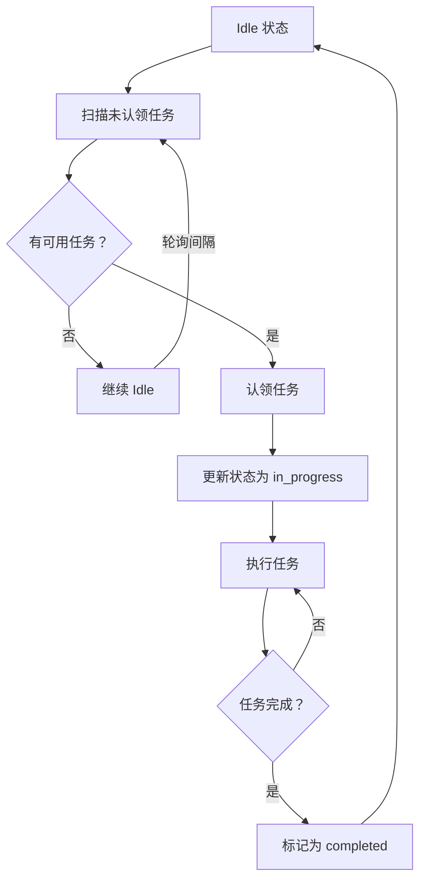

# s11 - Autonomous Agents: 自主代理机制

LearnAgent 支持自主代理，能够自动扫描未分配任务、主动认领并执行。

## 📖 原理介绍

### 核心思想

**自主性代理系统**：
- Idle 周期轮询新任务
- 自动认领未分配任务
- 身份重新注入（上下文压缩后）
- 基于锁的任务认领保护

### 与被动代理的区别

| 特性 | 被动代理 | 自主代理 |
|------|---------|---------|
| 任务来源 | 用户分配 | 主动认领 |
| 运行模式 | 等待指令 | 主动扫描 |
| 决策能力 | 无 | 有 |
| 复杂度 | 低 | 中 |

### 工作流程



### 关键组件

1. **任务扫描器** - `scan_unclaimed_tasks()`
2. **认领机制** - `claim_task()` + 锁保护
3. **Idle 工具** - `idle()` 进入空闲状态
4. **身份块** - `make_identity_block()` 重新注入身份

## 💻 实现方法

### 任务扫描

完整实现位于 [`src/learn_agent/autonomous_agents.py`](../src/learn_agent/autonomous_agents.py)

```python
def scan_unclaimed_tasks() -> List[dict]:
    """
    扫描未认领的任务
    
    Returns:
        未认领任务列表
    """
    from .task_system import get_task_manager
    manager = get_task_manager()
    
    # 获取所有任务
    tasks_dir = Path.cwd() / ".tasks"
    if not tasks_dir.exists():
        return []
    
    unclaimed = []
    for f in sorted(tasks_dir.glob("task_*.json")):
        try:
            task = json.loads(f.read_text())
            
            # 筛选条件:
            # 1. status=pending
            # 2. owner 为空
            # 3. blockedBy 为空（没有依赖阻塞）
            if (task.get("status") == "pending" 
                and not task.get("owner") 
                and not task.get("blockedBy")):
                unclaimed.append(task)
                
        except Exception:
            continue
    
    return unclaimed
```

**筛选条件**:
- ✅ `status == "pending"` - 待处理任务
- ✅ `owner` 为空 - 无人认领
- ✅ `blockedBy` 为空 - 没有被其他任务阻塞

### 认领任务

```python
# 全局锁保护认领过程
_claim_lock = threading.Lock()

def claim_task(task_id: int, owner: str) -> str:
    """
    认领任务
    
    Args:
        task_id: 任务 ID
        owner: 认领者名称
        
    Returns:
        认领结果
    """
    with _claim_lock:  # 线程安全
        manager = get_task_manager()
        try:
            result = manager.update(
                task_id, 
                status="in_progress",
                owner=owner
            )
            return f"Claimed task #{task_id} for {owner}"
        except Exception as e:
            return f"Error: {e}"
```

**使用示例**:
```python
# 自主代理认领任务
result = claim_task(task_id=1, owner="autonomous_agent")
# 输出：Claimed task #1 for autonomous_agent
```

### Idle 工具

```python
@tool
def idle() -> str:
    """
    进入空闲状态，轮询新任务
    
    Returns:
        状态信息
    """
    return "Entering idle phase. Will poll for new tasks."
```

**使用场景**:
- 队友完成任务后进入 idle
- 等待新任务分配
- 定期轮询

### 认领任务工具

```python
@tool
def claim_task_tool(task_id: int) -> str:
    """
    认领任务
    
    Args:
        task_id: 任务 ID
        
    Returns:
        认领结果
    """
    # 从上下文中获取当前队友名称（简化处理）
    return claim_task(task_id, "autonomous_agent")
```

### 身份重新注入

```python
def make_identity_block(name: str, role: str, team_name: str) -> dict:
    """
    创建身份块（用于上下文压缩后重新注入）
    
    Args:
        name: 队友名称
        role: 角色
        team_name: 团队名称
        
    Returns:
        身份消息字典
    """
    return {
        "role": "user",
        "content": f"<identity>You are '{name}', role: {role}, team: {team_name}. Continue your work.</identity>",
    }
```

**使用场景**:
- 上下文压缩后
- 重新激活队友时
- 恢复中断的任务

### Agent 集成

在 `teams.py` 的 `_teammate_loop()` 中集成：

```python
def _teammate_loop(self, name: str, role: str, prompt: str):
    """队友代理循环"""
    messages = [HumanMessage(content=prompt)]
    tools = self._teammate_tools()
    
    # 添加自主代理工具
    from .autonomous_agents import get_autonomous_tools
    tools.extend(get_autonomous_tools())
    
    for _ in range(50):
        # 检查收件箱
        inbox = local_bus.read_inbox(name)
        for msg in inbox:
            messages.append(HumanMessage(content=json.dumps(msg)))
        
        # 如果没有消息，可以进入 idle 状态
        if not inbox:
            # 调用 idle 工具
            idle_result = idle.invoke({})
            messages.append(HumanMessage(content=idle_result))
            
            # 扫描并认领任务
            unclaimed = scan_unclaimed_tasks()
            if unclaimed:
                # 认领第一个任务
                task = unclaimed[0]
                claim_result = claim_task(task['id'], name)
                messages.append(HumanMessage(content=claim_result))
        
        # ... 继续正常循环
```

### 全局函数

```python
def reset_autonomous():
    """重置自主代理状态"""
    pass  # 目前无需特殊重置

def get_autonomous_tools():
    """获取所有自主代理相关工具"""
    return [
        idle,
        claim_task_tool,
    ]
```

## 🎯 使用示例

### 基础自主行为

```python
# 队友完成任务后
agent.send_message("reviewer", "审查已完成")

# 进入 idle 状态
agent.run("/idle")
# 输出：Entering idle phase. Will poll for new tasks.

# 自动扫描任务
unclaimed = scan_unclaimed_tasks()
print(f"Found {len(unclaimed)} unclaimed tasks")

# 认领任务
if unclaimed:
    task = unclaimed[0]
    result = claim_task(task['id'], "reviewer")
    print(result)
    # 输出：Claimed task #5 for reviewer
```

### 实际工作流

```
场景：自主代码审查团队

1. Reviewer 完成当前任务
   → 进入 idle 状态

2. Idle 周期开始:
   - scan_unclaimed_tasks()
   - 发现任务 #6: "测试新功能"
   
3. 自动认领:
   - claim_task(6, "reviewer")
   - 更新任务状态：pending → in_progress
   - 设置 owner: "reviewer"

4. 开始执行任务:
   - read_file("src/new_feature.py")
   - 编写测试用例
   - write_file("tests/test_new_feature.py")

5. 完成任务:
   - task_update(6, status="completed")
   - 再次进入 idle 状态

6. 循环往复...
```

### 多自主代理协作

```python
# 创建多个自主代理
agent.spawn_teammate("reviewer", "审查员", "Review code autonomously")
agent.spawn_teammate("tester", "测试员", "Write tests autonomously")
agent.spawn_teammate("builder", "构建员", "Build project autonomously")

# 所有代理都进入 idle 状态，自动认领任务
# 每个代理独立运行，互不干扰

# 查看任务分配情况
agent.task_list()
# 输出:
# [x] #1: 任务 1 (owner: reviewer)
# [>] #2: 任务 2 (owner: tester)
# [ ] #3: 任务 3 (owner: builder)
```

## ⚙️ 配置选项

### 认领锁

```python
_claim_lock = threading.Lock()
```

确保多线程环境下不会重复认领同一任务。

### 轮询间隔

硬编码在队友循环中，可以通过修改源码调整：

```python
# 在 _teammate_loop() 中
IDLE_POLL_INTERVAL = 30  # 秒
time.sleep(IDLE_POLL_INTERVAL)
```

### 身份格式

```python
identity_format = "<identity>You are '{name}', role: {role}, team: {team_name}. Continue your work.</identity>"
```

可以自定义格式。

## 🐛 错误处理

### 常见错误

1. **重复认领**
   ```
   两个代理同时认领同一任务
   ```
   **解决**: 使用 `_claim_lock` 保护

2. **认领失败**
   ```
   Error: Task not found
   ```
   **解决**: 检查任务是否已被删除或完成

3. **死锁**
   ```
   代理互相等待
   ```
   **解决**: 避免循环依赖，设置超时

4. **Idle 不停轮询**
   ```
   资源消耗过大
   ```
   **解决**: 增加轮询间隔

## 📊 性能考虑

### 优势

✅ **自动化** - 减少人工干预  
✅ **主动性** - 主动寻找工作  
✅ **并行性** - 多个代理同时工作  
✅ **容错性** - 单个代理失败不影响整体  

### 劣势

⚠️ **资源消耗** - 持续轮询占用资源  
⚠️ **不可预测** - 行为较难控制  
⚠️ **协调困难** - 多个代理可能冲突  

### 最佳实践

1. **合理轮询间隔** - 30-60 秒为宜
2. **任务粒度适中** - 不宜过大或过小
3. **明确角色分工** - 减少任务冲突
4. **监控代理状态** - 及时发现异常
5. **优雅降级** - 失败后能恢复

## 🔗 与相关模块集成

### 与 Task System 集成 (s07)

```python
# 扫描任务时读取 JSON 文件
tasks_dir = Path.cwd() / ".tasks"
for f in tasks_dir.glob("task_*.json"):
    task = json.loads(f.read_text())
```

### 与团队协作集成 (s09)

```python
# 队友在 idle 时自动认领任务
def _teammate_loop(self, name, role, prompt):
    # ... 正常循环
    
    if not inbox:
        # 自主行为
        idle()
        unclaimed = scan_unclaimed_tasks()
        if unclaimed:
            claim_task(unclaimed[0]['id'], name)
```

### 与上下文压缩集成 (s06)

```python
# 压缩后重新注入身份
messages = compactor.compact(messages, llm)
identity = make_identity_block(name, role, team)
messages.append(HumanMessage(content=identity['content']))
```

## 🔗 相关模块

- [s09 - Agent Teams](s09-agent-teams.md) - 团队协作
- [s07 - Task System](s07-task-system.md) - 任务管理
- [s08 - Background Tasks](s08-background-tasks.md) - 后台执行

---

**下一步**: 了解 [Worktree 隔离机制](s12-worktree-isolation.md) →
