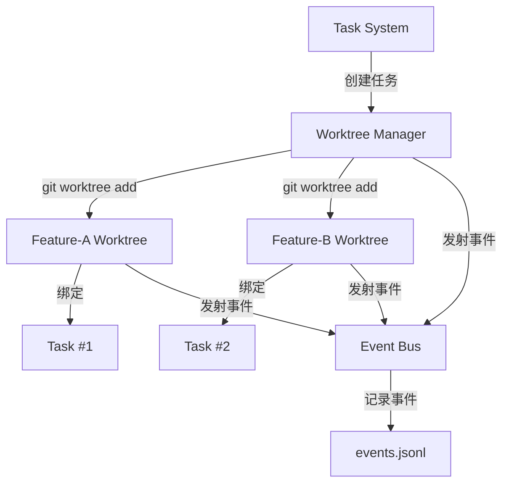

# s12 - Worktree Isolation: 工作树隔离机制

LearnAgent 通过 Git worktree 实现任务隔离，每个任务在独立的 Git 分支和工作目录中进行。

## 📖 原理介绍

### 核心问题

在开发过程中：
- 多个任务需要并行进行
- 代码变更可能互相干扰
- 切换分支耗时且容易出错
- 需要环境隔离

### 解决方案

**Git Worktree + 任务绑定**:
- 每个任务创建独立的 worktree
- worktree 有自己独立的分支
- 物理隔离的工作目录
- 任务完成后可以选择保留或删除 worktree

### 什么是 Git Worktree？

```bash
# 主仓库
project/ (main 分支)

# Worktree 1
project/.worktrees/feature-a/ -> wt/feature-a 分支
project/.worktrees/feature-b/ -> wt/feature-b 分支

# 每个 worktree 都是完整的 Git 仓库
# 可以独立 checkout、编译、运行
```

### 系统架构



### 关键特性

1. **物理隔离** - 每个 worktree 独立的工作目录
2. **分支绑定** - worktree 对应独立分支
3. **任务关联** - worktree 与 task_id 绑定
4. **生命周期管理** - create/remove/keep操作
5. **事件追踪** - 记录所有生命周期事件

## 💻 实现方法

### EventBus 类

完整实现位于 [`src/learn_agent/worktree_isolation.py`](../src/learn_agent/worktree_isolation.py)

```python
class EventBus:
    """事件总线 - 记录 worktree/任务生命周期事件"""
    
    def __init__(self, event_log_path: Path):
        self.path = event_log_path
        self.path.parent.mkdir(parents=True, exist_ok=True)
        if not self.path.exists():
            self.path.write_text("")
    
    def emit(self, event: str, task: dict = None, worktree: dict = None, error: str = None):
        """发射事件"""
        payload = {
            "event": event,
            "ts": time.time(),
            "task": task or {},
            "worktree": worktree or {},
        }
        if error:
            payload["error"] = error
        
        with self.path.open("a", encoding="utf-8") as f:
            f.write(json.dumps(payload) + "\n")
    
    def list_recent(self, limit: int = 20) -> str:
        """列出最近事件"""
        n = max(1, min(int(limit or 20), 200))
        lines = self.path.read_text(encoding='utf-8').splitlines()
        recent = lines[-n:]
        
        items = []
        for line in recent:
            try:
                items.append(json.loads(line))
            except Exception:
                items.append({"event": "parse_error", "raw": line})
        
        return json.dumps(items, indent=2)
```

**事件格式**:
```json
{
  "event": "worktree.create.after",
  "ts": 1709600000,
  "task": {"id": 1},
  "worktree": {
    "name": "feature-a",
    "path": "/path/to/worktree",
    "branch": "wt/feature-a",
    "status": "active"
  }
}
```

### WorktreeManager 类

```python
class WorktreeManager:
    """Worktree 管理器"""
    
    def __init__(self, repo_root: Path, events: EventBus):
        self.repo_root = repo_root
        self.events = events
        self.dir = repo_root / ".worktrees"
        self.dir.mkdir(parents=True, exist_ok=True)
        self.index_path = self.dir / "index.json"
        
        # 初始化索引
        if not self.index_path.exists():
            self.index_path.write_text(json.dumps({"worktrees": []}, indent=2))
        
        # 检查 git 可用性
        self.git_available = self._is_git_repo()
```

#### 1. 创建 Worktree

```python
def create(self, name: str, task_id: int = None, base_ref: str = "HEAD") -> str:
    """创建 worktree"""
    # 验证名称
    self._validate_name(name)
    
    # 检查是否已存在
    if self._find(name):
        raise ValueError(f"Worktree '{name}' already exists in index")
    
    path = self.dir / name
    branch = f"wt/{name}"
    
    # 发射创建前事件
    self.events.emit(
        "worktree.create.before",
        task={"id": task_id} if task_id is not None else {},
        worktree={"name": name, "base_ref": base_ref},
    )
    
    try:
        # 执行 git worktree add
        self._run_git(["worktree", "add", "-b", branch, str(path), base_ref])
        
        # 创建索引条目
        entry = {
            "name": name,
            "path": str(path),
            "branch": branch,
            "task_id": task_id,
            "status": "active",
            "created_at": time.time(),
        }
        
        # 保存到索引
        idx = self._load_index()
        idx["worktrees"].append(entry)
        self._save_index(idx)
        
        # 绑定任务（如果有）
        if task_id is not None:
            from .task_system import get_task_manager
            manager = get_task_manager()
            try:
                manager.update(task_id, owner=name)
            except Exception:
                pass
        
        # 发射创建后事件
        self.events.emit(
            "worktree.create.after",
            task={"id": task_id} if task_id is not None else {},
            worktree={
                "name": name,
                "path": str(path),
                "branch": branch,
                "status": "active",
            },
        )
        
        return json.dumps(entry, indent=2)
    
    except Exception as e:
        # 发射失败事件
        self.events.emit(
            "worktree.create.failed",
            task={"id": task_id} if task_id is not None else {},
            worktree={"name": name, "base_ref": base_ref},
            error=str(e),
        )
        raise
```

**使用示例**:
```python
manager.create(name="feature-a", task_id=1, base_ref="main")
# 输出:
# {
#   "name": "feature-a",
#   "path": "/path/to/.worktrees/feature-a",
#   "branch": "wt/feature-a",
#   "task_id": 1,
#   "status": "active",
#   "created_at": 1709600000
# }
```

#### 2. 列出 Worktree

```python
def list_all(self) -> str:
    """列出所有 worktree"""
    idx = self._load_index()
    wts = idx.get("worktrees", [])
    
    if not wts:
        return "No worktrees in index."
    
    lines = []
    for wt in wts:
        suffix = f" task={wt['task_id']}" if wt.get("task_id") else ""
        lines.append(f"[{wt.get('status', 'unknown')}] {wt['name']} -> {wt['path']} ({wt.get('branch', '-')}){suffix}")
    
    return "\n".join(lines)
```

**输出示例**:
```
[active] feature-a -> /path/to/.worktrees/feature-a (wt/feature-a) task=1
[active] feature-b -> /path/to/.worktrees/feature-b (wt/feature-b) task=2
[removed] feature-c -> /path/to/.worktrees/feature-c (wt/feature-c)
```

#### 3. 查看状态

```python
def status(self, name: str) -> str:
    """查看 worktree 状态"""
    wt = self._find(name)
    if not wt:
        return f"Error: Unknown worktree '{name}'"
    
    path = Path(wt["path"])
    if not path.exists():
        return f"Error: Worktree path missing: {path}"
    
    # 运行 git status
    r = subprocess.run(
        ["git", "status", "--short", "--branch"],
        cwd=path,
        capture_output=True,
        text=True,
        timeout=60,
    )
    
    text = (r.stdout + r.stderr).strip()
    return text or "Clean worktree"
```

#### 4. 在 Worktree 中运行命令

```python
def run(self, name: str, command: str) -> str:
    """在 worktree 中运行命令"""
    # 安全检查
    dangerous = ["rm -rf /", "sudo", "shutdown", "reboot", "> /dev/"]
    if any(d in command for d in dangerous):
        return "Error: Dangerous command blocked"
    
    wt = self._find(name)
    if not wt:
        return f"Error: Unknown worktree '{name}'"
    
    path = Path(wt["path"])
    if not path.exists():
        return f"Error: Worktree path missing: {path}"
    
    try:
        r = subprocess.run(
            command,
            shell=True,
            cwd=path,
            capture_output=True,
            text=True,
            timeout=300,
        )
        out = (r.stdout + r.stderr).strip()
        return out[:50000] if out else "(no output)"
    except subprocess.TimeoutExpired:
        return "Error: Timeout (300s)"
```

#### 5. 删除 Worktree

```python
def remove(self, name: str, force: bool = False, complete_task: bool = False) -> str:
    """删除 worktree"""
    wt = self._find(name)
    if not wt:
        return f"Error: Unknown worktree '{name}'"
    
    # 发射删除前事件
    self.events.emit(
        "worktree.remove.before",
        task={"id": wt.get("task_id")} if wt.get("task_id") is not None else {},
        worktree={"name": name, "path": wt.get("path")},
    )
    
    try:
        # 执行 git worktree remove
        args = ["worktree", "remove"]
        if force:
            args.append("--force")
        args.append(wt["path"])
        self._run_git(args)
        
        # 完成任务（如果指定）
        if complete_task and wt.get("task_id") is not None:
            from .task_system import get_task_manager
            manager = get_task_manager()
            try:
                manager.update(wt["task_id"], status="completed")
                self.events.emit(
                    "task.completed",
                    task={"id": wt["task_id"]},
                    worktree={"name": name},
                )
            except Exception:
                pass
        
        # 更新索引
        idx = self._load_index()
        for item in idx.get("worktrees", []):
            if item.get("name") == name:
                item["status"] = "removed"
                item["removed_at"] = time.time()
        self._save_index(idx)
        
        # 发射删除后事件
        self.events.emit(
            "worktree.remove.after",
            task={"id": wt.get("task_id")} if wt.get("task_id") is not None else {},
            worktree={"name": name, "path": wt.get("path"), "status": "removed"},
        )
        
        return f"Removed worktree '{name}'"
    
    except Exception as e:
        # 发射失败事件
        self.events.emit(
            "worktree.remove.failed",
            task={"id": wt.get("task_id")} if wt.get("task_id") is not None else {},
            worktree={"name": name, "path": wt.get("path")},
            error=str(e),
        )
        raise
```

#### 6. 保留 Worktree

```python
def keep(self, name: str) -> str:
    """保留 worktree（标记为保留但不删除）"""
    wt = self._find(name)
    if not wt:
        return f"Error: Unknown worktree '{name}'"
    
    idx = self._load_index()
    kept = None
    for item in idx.get("worktrees", []):
        if item.get("name") == name:
            item["status"] = "kept"
            item["kept_at"] = time.time()
            kept = item
    self._save_index(idx)
    
    self.events.emit(
        "worktree.keep",
        task={"id": wt.get("task_id")} if wt.get("task_id") is not None else {},
        worktree={"name": name, "path": wt.get("path"), "status": "kept"},
    )
    
    return json.dumps(kept, indent=2) if kept else f"Error: Unknown worktree '{name}'"
```

### 工具定义

七个 LangChain 工具：

```python
@tool
def worktree_create(name: str, task_id: int = None, base_ref: str = "HEAD") -> str:
    """创建 worktree"""
    manager = get_worktree_manager()
    return manager.create(name, task_id, base_ref)

@tool
def worktree_list() -> str:
    """列出 worktree"""
    manager = get_worktree_manager()
    return manager.list_all()

@tool
def worktree_status(name: str) -> str:
    """查看 worktree 状态"""
    manager = get_worktree_manager()
    return manager.status(name)

@tool
def worktree_run(name: str, command: str) -> str:
    """在 worktree 中运行命令"""
    manager = get_worktree_manager()
    return manager.run(name, command)

@tool
def worktree_remove(name: str, force: bool = False, complete_task: bool = False) -> str:
    """删除 worktree"""
    manager = get_worktree_manager()
    return manager.remove(name, force, complete_task)

@tool
def worktree_keep(name: str) -> str:
    """保留 worktree"""
    manager = get_worktree_manager()
    return manager.keep(name)

@tool
def worktree_events(limit: int = 20) -> str:
    """查看最近事件"""
    bus = get_event_bus()
    return bus.list_recent(limit)
```

### 全局实例

```python
# 全局事件总线实例
_events_bus: Optional[EventBus] = None

# 全局 worktree 管理器实例
_worktree_manager: Optional[WorktreeManager] = None

def get_event_bus() -> EventBus:
    """获取事件总线"""
    global _events_bus
    if _events_bus is None:
        _events_bus = EventBus(PROJECT.data_dir / ".worktrees" / "events.jsonl")
    return _events_bus

def get_worktree_manager() -> WorktreeManager:
    """获取 worktree 管理器"""
    global _worktree_manager
    if _worktree_manager is None:
        _worktree_manager = WorktreeManager(REPO_ROOT, get_event_bus())
    return _worktree_manager

def reset_worktree():
    """重置 worktree 管理器"""
    global _worktree_manager, _events_bus
    _worktree_manager = None
    _events_bus = None
```

## 🎯 使用示例

### 基础工作流

```python
# 1. 创建任务
agent.task_create("开发新功能 A")

# 2. 创建 worktree 并绑定任务
agent.worktree_create(name="feature-a", task_id=1, base_ref="main")
# 输出:
# {
#   "name": "feature-a",
#   "path": "...",
#   "branch": "wt/feature-a",
#   "task_id": 1
# }

# 3. 在 worktree 中开发
agent.worktree_run("feature-a", "npm install")
agent.worktree_run("feature-a", "npm run dev")

# 4. 查看状态
agent.worktree_status("feature-a")
# 输出：
# ## wt/feature-a
# M src/feature.py
# ?? new_file.py

# 5. 列出所有 worktree
agent.worktree_list()
# 输出:
# [active] feature-a -> ... (wt/feature-a) task=1

# 6. 完成任务后删除 worktree
agent.worktree_remove("feature-a", complete_task=True)
# 自动将任务 1 标记为 completed
```

### 多任务并行

```python
# 创建三个并行任务
agent.task_create("功能 A")  # 任务 1
agent.task_create("功能 B")  # 任务 2
agent.task_create("功能 C")  # 任务 3

# 为每个任务创建独立 worktree
agent.worktree_create("feature-a", task_id=1)
agent.worktree_create("feature-b", task_id=2)
agent.worktree_create("feature-c", task_id=3)

# 在各个 worktree 中独立开发
agent.worktree_run("feature-a", "npm test")
agent.worktree_run("feature-b", "npm test")
agent.worktree_run("feature-c", "npm test")

# 互不干扰！
```

### 查看事件历史

```python
# 查看最近 20 个事件
events = agent.worktree_events(limit=20)
print(events)
# 输出:
# [
#   {"event": "worktree.create.after", "ts": ..., "task": {"id": 1}, ...},
#   {"event": "worktree.remove.after", "ts": ..., "task": {"id": 1}, ...}
# ]
```

## ⚙️ 配置选项

### 存储位置

```python
from .project_config import get_project_config
PROJECT = get_project_config()
WORKDIR = PROJECT.data_dir
REPO_ROOT = PROJECT.project_root

# Worktree 目录
WORKTREES_DIR = REPO_ROOT / ".worktrees"

# 事件日志
EVENTS_LOG = WORKDIR / ".worktrees" / "events.jsonl"

# 索引文件
INDEX_FILE = WORKTREES_DIR / "index.json"
```

### 名称验证

```python
def _validate_name(self, name: str):
    """验证名称格式"""
    if not re.fullmatch(r"[A-Za-z0-9._-]{1,40}", name or ""):
        raise ValueError("Invalid worktree name. Use 1-40 chars: letters, numbers, ., _, -")
```

### Git 检查

```python
def _is_git_repo(self) -> bool:
    """检查是否是 git 仓库"""
    try:
        r = subprocess.run(
            ["git", "rev-parse", "--is-inside-work-tree"],
            cwd=self.repo_root,
            capture_output=True,
            text=True,
            timeout=10,
        )
        return r.returncode == 0
    except Exception:
        return False
```

## 🐛 错误处理

### 常见错误

1. **非 Git 仓库**
   ```
   RuntimeError: Not in a git repository
   ```
   **解决**: 在项目根目录初始化 git

2. **名称冲突**
   ```
   ValueError: Worktree 'feature-a' already exists
   ```
   **解决**: 使用不同的名称或先删除

3. **路径不存在**
   ```
   Error: Worktree path missing: ...
   ```
   **解决**: worktree 可能已被手动删除

4. **强制删除需要 --force**
   ```
   git worktree remove failed
   ```
   **解决**: 使用 `worktree_remove(name, force=True)`

## 📊 性能考虑

### 优势

✅ **完全隔离** - 每个任务独立的工作目录和分支  
✅ **并行开发** - 多个任务同时进行互不干扰  
✅ **快速切换** - 比 git checkout 更快  
✅ **审计追踪** - 完整的事件日志  

### 劣势

⚠️ **磁盘空间** - 每个 worktree 占用额外空间  
⚠️ **Git 依赖** - 必须在 git 仓库中  
⚠️ **管理复杂度** - 需要维护多个 worktree  

### 最佳实践

1. **命名规范** - 使用清晰的命名（feature-xxx, bugfix-xxx）
2. **及时清理** - 完成后删除不再需要的 worktree
3. **保留重要分支** - 使用 `worktree_keep` 标记
4. **监控事件** - 定期查看 events.jsonl
5. **任务绑定** - 始终将 worktree 与 task_id 关联

## 🔗 与相关模块集成

### 与 Task System 集成 (s07)

```python
# 创建 worktree 时自动绑定任务
manager.create(name="feature-a", task_id=1)
# → task_update(1, owner="feature-a")

# 删除 worktree 时可自动完成任务
manager.remove(name="feature-a", complete_task=True)
# → task_update(1, status="completed")
```

### 与团队协作集成 (s09)

```python
# 队友在特定 worktree 中工作
agent.spawn_teammate("developer", "开发者", "Develop in feature-a worktree")
agent.worktree_run("feature-a", "npm run build")
```

### 与自主代理集成 (s11)

```python
# 自主代理认领任务并创建 worktree
unclaimed = scan_unclaimed_tasks()
if unclaimed:
    task = unclaimed[0]
    claim_task(task['id'], "autonomous_agent")
    worktree_create(f"task-{task['id']}", task_id=task['id'])
```

## 🔗 相关模块

- [s07 - Task System](s07-task-system.md) - 任务管理
- [s09 - Agent Teams](s09-agent-teams.md) - 团队协作
- [s11 - Autonomous Agents](s11-autonomous-agents.md) - 自主代理

---

**恭喜完成所有 Learn 系列文档!** 🎉
